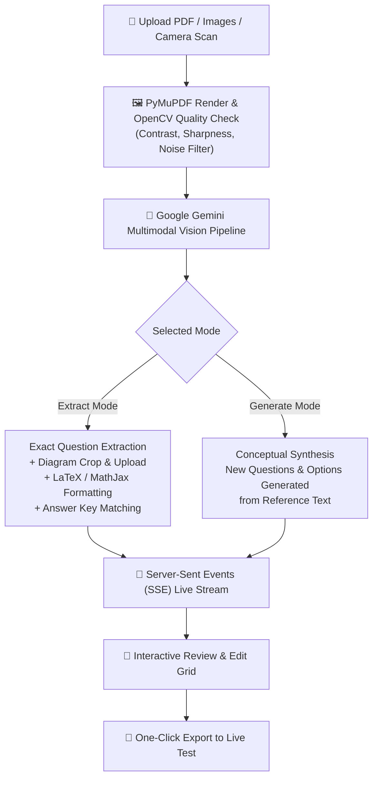
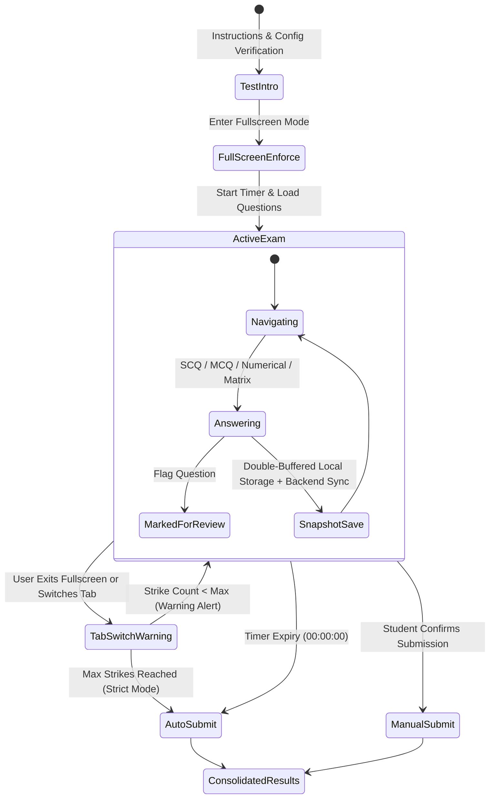
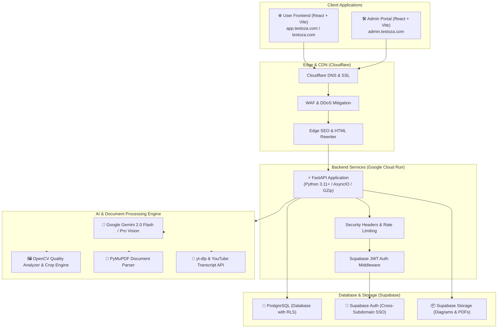

# 🚀 TestoZa — Comprehensive Platform & Product Overview

> **"Auto-Create. Revise. Share. Connect. Practice. Evaluate."**  
> *An AI-first, high-stakes assessment infrastructure, cognitive analytics engine, and creator ecosystem for students, educators, coaching institutes, and EdTech platforms.*

---

## 📌 Table of Contents
1. [Executive Summary](#1-executive-summary)
2. [The Problem & The TestoZa Solution](#2-the-problem--the-testoza-solution)
3. [Target Audiences & Use Cases](#3-target-audiences--use-cases)
4. [Core Architectural Pillars & Feature Breakdown](#4-core-architectural-pillars--feature-breakdown)
   - [Pillar 1: Multimodal AI Test Creator & Question Extractor](#pillar-1-multimodal-ai-test-creator--question-extractor)
   - [Pillar 2: High-Stakes Proctored Examination Engine](#pillar-2-high-stakes-proctored-examination-engine)
   - [Pillar 3: Deep Cognitive & Behavioral Analytics Suite](#pillar-3-deep-cognitive--behavioral-analytics-suite)
   - [Pillar 4: Creator Economy & Institutional White-Labeling](#pillar-4-creator-economy--institutional-white-labeling)
   - [Pillar 5: Community, News & Study Materials](#pillar-5-community-news--study-materials)
   - [Pillar 6: Dedicated Administration & Telemetry Center](#pillar-6-dedicated-administration--telemetry-center)
5. [End-to-End System Architecture](#5-end-to-end-system-architecture)
6. [Technology Stack & Infrastructure](#6-technology-stack--infrastructure)
7. [Repository Ecosystem & Deployment Architecture](#7-repository-ecosystem--deployment-architecture)
8. [Security, Proctoring & Compliance Hardening](#8-security-proctoring--compliance-hardening)
9. [Product Roadmap & Future Horizons](#9-product-roadmap--future-horizons)

---

## 1. Executive Summary

**TestoZa** (also referred to as the **NKC Test Platform**) is a modern, full-stack, AI-native assessment platform designed to eliminate the friction in creating, conducting, analyzing, and distributing competitive mock exams. 

Whether preparing for high-stakes entrance exams (such as **JEE Main & Advanced, NEET, GATE, CUET, BITSAT, UPSC, SSC, and State Boards**) or running classroom quizzes, TestoZa brings the precision of national-level testing agencies (like NTA) into an intuitive, accessible web platform.

```
┌─────────────────────────────────────────────────────────────────────────────────────────┐
│                                       TESTOZA                                           │
│  ┌───────────────────────┐   ┌───────────────────────────┐   ┌────────────────────────┐ │
│  │   AI Multimodal Test   │   │   Proctored Exam Engine   │   │  Behavioral Analytics  │ │
│  │  PDF / Image / YouTube│──▶│  JEE / NEET / Custom Modes│──▶│  4-Quadrant Matrix    │ │
│  │  LaTeX + Chemical Math│   │  Anti-Cheat & Auto-Resume │   │  Speed vs. Accuracy    │ │
│  └───────────────────────┘   └───────────────────────────┘   └────────────────────────┘ │
│                                            │                                            │
│                      ┌─────────────────────┴─────────────────────┐                      │
│                      ▼                                           ▼                      │
│        ┌───────────────────────────┐               ┌───────────────────────────┐        │
│        │  Public Creator Feed &    │               │  Institutional Control &  │        │
│        │  Study Materials Sharing  │               │  Admin Telemetry Suite    │        │
│        └───────────────────────────┘               └───────────────────────────┘        │
└─────────────────────────────────────────────────────────────────────────────────────────┘
```

### Key Platform Metrics & Attributes
- **Live Production URL**: [https://testoza.com](https://testoza.com)
- **Admin Control Center**: [https://admin.testoza.com](https://admin.testoza.com)
- **Backend API Endpoint**: Google Cloud Run + Cloudflare Proxy
- **Core Engine Capabilities**: Multimodal OCR + Vision AI Question Extraction, Complex Marking Schemes (Partial, Negative, Numerical Ranges), Behavioral Time Quadrant Analytics, Full-Screen Lockdown Proctoring, Cross-Subdomain Single Sign-On (SSO).

---

## 2. The Problem & The TestoZa Solution

### The Broken State of Assessment Today

| Current Alternative | Major Bottlenecks |
|:---|:---|
| **Google Forms / Microsoft Forms** | Basic multiple-choice only. No support for complex JEE/NEET partial marking, numerical range matching, LaTeX formulas, anti-cheating full-screen enforcement, or question palettes. |
| **Moodle / Open-Source LMS** | Clunky 2000s-era user interface, complex hosting requirements, severe mobile rendering issues, and requires high technical overhead to maintain. |
| **Enterprise Commercial LMS** | Extremely expensive per-seat pricing, closed proprietary silos, zero creator monetization, and rigid exam templates. |
| **Telegram / WhatsApp Groups** | Unstructured PDFs with disconnected answer keys. Students cannot gauge real-time time-management, negative marking impact, or cognitive speed-vs-accuracy trade-offs. |

### The TestoZa Solution
TestoZa unifies **creation**, **execution**, **analytics**, and **distribution** into a cohesive pipeline:

1. **Instant Creation via Vision AI**: Turn physical question papers, scanned PDFs, handwritten notes, or YouTube video lectures into rich interactive exams with LaTeX formulas, diagrams, and auto-matched answer keys in under 60 seconds.
2. **True National-Standard Exam Simulation**: Section-wise navigation, JEE Advanced-style multiple correct partial marking (`+4, +3, +2, +1, -2`), numerical precision bounds, and combined multi-paper workflows (Paper 1 $\rightarrow$ Mandatory Break $\rightarrow$ Paper 2).
3. **Cognitive & Behavioral Diagnostics**: Rather than just showing "Score: 78/100", TestoZa classifies every attempt into behavioral quadrants (Direct Recall, Deep Thinking, Reckless Errors, Time Traps) and flags blind guessing.
4. **Creator & Institutional Empowerment**: Educators can publish tests publicly to gain followers, or white-label tests with institutional branding (logos, watermarks, private link access).

---

## 3. Target Audiences & Use Cases

### 1. 🎓 Students & Competitive Aspirants (JEE, NEET, GATE, CUET, Govt Exams)
- **Real Exam Environment**: Practice under exact NTA-style UI conditions (Question palette, countdown timers, scientific calculator, review flags).
- **Behavioral Self-Discovery**: Identify where time was wasted on "time-trap" questions and eliminate careless mistakes.
- **YouTube to Test**: Paste any YouTube video lecture URL to get instant revision notes and an interactive quiz to verify comprehension.

### 2. 👨‍🏫 Independent Educators & Tutors
- **Zero-Friction Digitization**: Upload past year question papers (PDF/PNG) and get an interactive test without manually typing math equations or uploading images one by one.
- **Audience Growth**: Build a verified creator profile on TestoZa, distribute tests via custom links, and track student engagement.

### 3. 🏫 Coaching Institutes & Schools
- **Institutional Branding**: Embed institute name and logo directly onto the test header and result reports.
- **Controlled Result Release**: Choose between instant student feedback or hidden results (released only after institute review).
- **Proctored Examinations**: Conduct online tests with full-screen enforcement and tab-switch tracking to prevent academic dishonesty.

### 4. 🌐 EdTech Creators & Publishers
- Distribute free or premium practice series to thousands of students through the integrated discovery feed, study material repository, and educational newsfeed.

---

## 4. Core Architectural Pillars & Feature Breakdown

---

### Pillar 1: Multimodal AI Test Creator & Question Extractor

Located at `/generate-with-ai` and `/convert`, this AI pipeline enables instant paper digitization and dynamic question generation.



#### Detailed Capabilities:
- **Deep Multimodal OCR & LaTeX Recognition**: Extracts complex mathematical formulas ($\int_0^\infty e^{-x^2} dx$), chemical equations, matrices, and subscript/superscript notation directly into KaTeX/MathJax formatting.
- **Automated Diagram Cropping**: Automatically identifies question graphs, circuit diagrams, and geometric figures, crops them, and uploads them to Supabase Storage.
- **Cross-Page Question Stitching**: Seamlessly reconstructs questions split across page breaks and matches separate answer keys located at the end of PDF documents.
- **YouTube Lecture to Test**: Powered by `youtube-transcript-api` and `yt-dlp`. Fetches video transcripts, generates comprehensive structured revision notes, and creates a customized quiz on the lecture's core concepts.
- **WebMCP Tool Integration**: Exposes natural language test generation tools for AI agents and agentic browsers.

---

### Pillar 2: High-Stakes Proctored Examination Engine

The exam engine (`/test/:id`) simulates rigorous national entrance examinations with robust anti-cheating measures.



#### Question Archetypes Supported:
1. **Single Choice Question (SCQ)**: Standard single-option selection.
2. **Multiple Correct Questions (MCQ)**: Advanced partial marking algorithms:
   - Full marks: All correct options chosen, no incorrect option selected.
   - Partial marks: Subset of correct options chosen without any incorrect options.
   - Negative marks: Any incorrect option chosen.
3. **Numerical Value Questions**: Exact float matching or **Range Bounds** (e.g. $[3.14, 3.16]$) to account for rounding differences.
4. **Matrix Match & Assertion-Reasoning**: Multi-column association questions.
5. **Image-Based Options & Questions**: Visual questions with image options.

#### Exam Structure & Features:
- **Section Navigation**: Create subject sections (e.g. Physics Section A [MCQs] & Section B [Numericals], Chemistry, Mathematics).
- **Per-Question / Per-Section Marking Overrides**: Custom positive and negative marks per section (e.g. `+4 / -1`, `+3 / -1`, `+2 / 0`).
- **NTA-Standard Palette**: Instant color indicators for *Not Visited*, *Not Answered*, *Answered*, *Marked for Review*, and *Answered & Marked for Review*.
- **Virtual Scientific Calculator**: Built-in floating calculator for engineering/science calculations.
- **Combined Multi-Paper Flow**: Seamlessly handles two-session exams (e.g., JEE Advanced Paper 1 and Paper 2) with a synchronized mandatory break screen and merged analytics.

#### Security & Proctoring Safeguards:
- **Fullscreen Lockdown**: Continuous fullscreen enforcement during the exam.
- **Tab-Switch & Blur Detection**: Tracks window focus loss and logs each occurrence.
- **Multi-Strike Warning System**: Configurable warning threshold before auto-submitting.
- **Content Protection**: Right-click, copy-paste, text selection, and keyboard shortcuts (`Ctrl+C`, `Ctrl+V`, `F12`) disabled.
- **Disaster Recovery & Session Resilience**: Double-buffered snapshotting (`localStorage` + `sessionStorage`) plus periodic backend synchronization ensures zero data loss during power cuts, browser crashes, or network interruptions.

---

### Pillar 3: Deep Cognitive & Behavioral Analytics Suite

Located at `/results/:id` and `/advanced-analysis/:id`, TestoZa transforms raw test scores into actionable cognitive insights.

```
┌─────────────────────────────────────────────────────────────────────────────────────────┐
│                           4-QUADRANT BEHAVIORAL TIME MATRIX                             │
│                                                                                         │
│     HIGH ACCURACY (CORRECT)                 HIGH ACCURACY (CORRECT)                     │
│     ⚡ FAST RESPONSE                         ⏳ SLOW RESPONSE                           │
│     ┌─────────────────────────────┐         ┌─────────────────────────────┐             │
│     │   DIRECT RECALL / MASTERY   │         │   DEEP THINKER / DILIGENT   │             │
│     │   Strong conceptual grasp;  │         │   Solved correctly but took │             │
│     │   answers instinctively.    │         │   excessive problem time.   │             │
│     └─────────────────────────────┘         └─────────────────────────────┘             │
│                                                                                         │
│     LOW ACCURACY (WRONG)                    LOW ACCURACY (WRONG)                        │
│     ⚡ FAST RESPONSE                         ⏳ SLOW RESPONSE                           │
│     ┌─────────────────────────────┐         ┌─────────────────────────────┐             │
│     │   RECKLESS / SILLY MISTAKE  │         │   TIME TRAP / HIGH CONFUSION│             │
│     │   Rushed through question;  │         │   Spent maximum time only   │             │
│     │   careless reading/guess.   │         │   to get negative marks!    │             │
│     └─────────────────────────────┘         └─────────────────────────────┘             │
└─────────────────────────────────────────────────────────────────────────────────────────┘
```

#### Diagnostic Metrics:
- **Cognitive Time Quadrants**: Automatically buckets every question into *Direct Recall*, *Deep Thinker*, *Reckless*, or *Time Trap* based on benchmark pace vs. actual time spent.
- **Guess Detection Engine**: Identifies anomalous rapid answers on high-difficulty questions.
- **Section Radar & Subject Breakdown**: Visual representation of strengths and weaknesses across Physics, Chemistry, Mathematics, Biology, etc.
- **Speed vs. Accuracy Curves**: Correlates response speed with question correctness.
- **Comprehensive Solution Walkthrough**: Step-by-step written explanations and embedded video solutions for every question.

---

### Pillar 4: Creator Economy & Institutional White-Labeling

TestoZa bridges the gap between assessment software and an educational discovery platform:

- **Public Test Discovery Feed**: Categorized by target exam, subject, and trending topics with infinite scroll.
- **Verified Creator System**: Highlighting verified educators and coaching faculties.
- **Creator Profiles**: Dedicated public profiles (`/creator/:id`) displaying published tests, total attempts, upvotes, and creator bio.
- **Institutional Branding**: Custom institute name, logo watermarking, and private/public test visibility toggles.
- **Test Cloning**: Educators can clone existing tests to customize questions and adjust marking schemes.

---

### Pillar 5: Community, News & Study Materials

- **Educational NewsFeed (`/news`)**: Integrated publishing system with a rich TipTap editor for exam updates, syllabus changes, and preparation strategies.
- **Study Materials Repository (`/materials`)**: Centralized portal for sharing formula sheets, chapter summaries, and past-year solved papers.
- **Gamification & Rewards (`/rewards`)**: Daily practice streaks, performance badges, and platform coins.

---

### Pillar 6: Dedicated Administration & Telemetry Center

Located in the isolated `frontend-admin` SPA at `admin.testoza.com`:

```
┌─────────────────────────────────────────────────────────────────────────────────────────┐
│                                ADMIN CONTROL CENTER                                     │
│  ┌───────────────────────────┐   ┌───────────────────────────┐   ┌────────────────────┐ │
│  │   AI Token Usage Audit    │   │  Email Broadcast Manager  │   │  Dynamic Feature   │ │
│  │  Track cost/tokens per job│   │  Segmented HTML campaigns │   │  Flags & Config    │ │
│  └───────────────────────────┘   └───────────────────────────┘   └────────────────────┘ │
│  ┌───────────────────────────┐   ┌───────────────────────────┐   ┌────────────────────┐ │
│  │   Test & Content Mod      │   │  Promo Codes & Pricing    │   │  System Migration  │ │
│  │  Approve / edit / moderate│   │  Discounts, tiers & plans │   │  & Database Ops    │ │
│  └───────────────────────────┘   └───────────────────────────┘   └────────────────────┘ │
└─────────────────────────────────────────────────────────────────────────────────────────┘
```

- **AI Token Audit Panel**: Real-time logging of Gemini API token consumption, processing latency, and operational costs.
- **Email Broadcast Engine**: Target all users, active test takers, or creators with customizable HTML email campaigns and tracking metrics.
- **Dynamic Remote Feature Flags**: Toggle platform features on/off instantly without deploying code.
- **Commercial Management**: Create promo discount codes, adjust subscription tiers, and review payments.

---

## 5. End-to-End System Architecture



---

## 6. Technology Stack & Infrastructure

### Frontend Applications (`frontend` & `frontend-admin`)
- **Framework**: React 18 with TypeScript
- **Build Tool**: Vite (SWC plugin, rollup visualizer, terser minification)
- **Styling**: TailwindCSS, ShadCN UI, Radix UI Primitives, Framer Motion
- **Math & Science Rendering**: KaTeX, MathJax, `react-latex-next`, ChemDoodle
- **Rich Text Editor**: TipTap (StarterKit, Tables, Resizable Images, Math extensions)
- **Icons & Visuals**: Lucide React, Canvas Confetti
- **State & Data Fetching**: TanStack React Query, Axios, Native SSE EventSource
- **Testing**: Playwright End-to-End Suite (Desktop & Mobile viewports)

### Backend Application (`backend`)
- **Framework**: FastAPI (Python 3.11+)
- **Server**: Uvicorn with AsyncIO
- **Validation**: Pydantic v2 & Pydantic-Settings
- **Compression & Performance**: GZip Middleware (cuts JSON payloads by >70%), `cachetools`
- **Security**: Strict CORS policy, HTTPBearer JWT validation, nosniff, frame-ancestors 'none', CSP

### AI & Media Processing
- **LLM / Vision**: Google Gemini 2.0 Flash / Gemini 1.5 Pro via `google-genai` & `google-generativeai`
- **Computer Vision**: OpenCV Headless (`cv2`), Pillow (`PIL`), NumPy
- **Document Parsing**: PyMuPDF (`fitz`)
- **Audio/Video Extraction**: `youtube-transcript-api`, `yt-dlp`

### Database, Auth & Cloud Storage
- **Database**: PostgreSQL hosted on Supabase with Row Level Security (RLS) policies
- **Authentication**: Supabase Auth with Cross-Subdomain shared cookie JWT architecture
- **Storage**: Supabase Storage Buckets for question images, cropped diagrams, and study materials

### Hosting, Edge & DevOps
- **Backend Hosting**: Google Cloud Run (Serverless autoscaling containers)
- **Frontend Hosting**: Vercel / Cloudflare Pages
- **DNS & CDN**: Cloudflare (Edge caching, SSL, WAF, SEO Workers)

---

## 7. Repository Ecosystem & Deployment Architecture

The project is managed via a coordinated multi-repository structure:

| Repository Name | Local Path | Remote Git URL | Responsibility |
|:---|:---|:---|:---|
| **Root / Integration** | `.` | `nirwairkumar/nkc-test` | Master coordination, infrastructure configurations, and shared docs |
| **Frontend App** | `frontend/` | `nirwairkumar/nkc-test-2.0-frontend` | Main student and creator facing web application |
| **Backend App** | `backend/` | `nirwairkumar/nkc-test-2.0-backend` | FastAPI server, AI pipelines, and database migrations |
| **Admin App** | `frontend-admin/` | `nirwairkumar/nkc-test-admin` | Internal administration, AI auditing, and email campaigns |

### Deployment Workflows
- `/.agent/workflows/push-all.md`: Pushes updates across all 4 repositories synchronously.
- `/.agent/workflows/push-gcp.md`: Synchronizes and deploys changes to the GCP migration branch.

---

## 8. Security, Proctoring & Compliance Hardening

1. **Cross-Subdomain Single Sign-On (SSO)**: Secure cookie sharing across `testoza.com`, `app.testoza.com`, and `admin.testoza.com` with isolated role-based authorization.
2. **Google Ads & Anti-Cloaking Compliance**: Full alignment with Google Ad policies, dynamic sitemaps (`/sitemap.xml`), and zero cloaking.
3. **Chunk Loading Error Recovery**: Automatic edge reload mechanisms to handle dynamic import cache mismatches during continuous production deployments.
4. **Rate Limiting & Abuse Prevention**: Per-IP and per-user token rate limiting on AI extraction and exam submission routes.

---

## 9. Product Roadmap & Future Horizons

- [ ] **Multiplayer Live Exam Battles**: Real-time synchronized live tests with dynamic national leaderboards.
- [ ] **AI Adaptive Practice Engine**: Automatically analyzes student weaknesses and generates targeted daily practice sets.
- [ ] **Coaching Batch Management**: Multi-tier student batch scheduling, attendance tracking, and automated parent SMS/WhatsApp performance reports.
- [ ] **Progressive Web App (PWA) & Native Mobile App**: Offline test-taking mode with background synchronization.

---

<div align="center">

**TestoZa — Transforming Assessment for the Next Billion Learners.**  
*Created and Maintained by Nirwair Kumar Chaudhary.*

</div>
