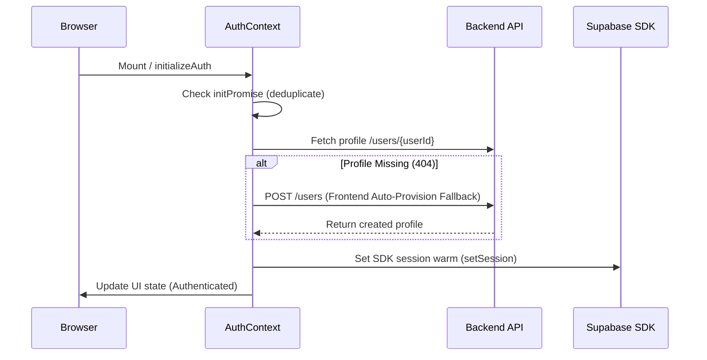

# Authentication Resilience and Cross-Subdomain Single Sign-On (SSO)

**Date:** June 30, 2026  
**Status:** Completed  
**Authors:** Antigravity (AI Coding Assistant)  

---

## 1. Executive Summary

To deliver a reliable, enterprise-grade user experience on TestoZa, we identified and resolved two critical authentication bottlenecks:
1. **Onboarding Logout Loop:** A race condition and aggressive token erasure during Google OAuth sign-in caused new users to be silently logged out when redirected to the `/onboarding` page, leading to a `"User not found"` error.
2. **Cross-Subdomain Session Loss:** Since browser `localStorage` is isolated by subdomain, users logging in on `app.testoza.com` appeared logged out when returning to the marketing homepage (`testoza.com`), and vice-versa.

This document details the architecture, design, and changes implemented to resolve these issues.

---

## 2. Onboarding & Auth Initialization Resilience

### The Bottleneck
Previously, the auth initialization routine in `AuthContext.tsx` ran in a parallelized `Promise.all` block. When a new Google OAuth user signed in, their public profile row in the database did not exist yet (as auto-provisioning could fail on the backend due to container environment credentials). 

The `/users/{user_id}` route returned a `404 Not Found`. This error was caught by the outer `catch` block of the initialization cycle, which immediately wiped the user's `testoza_token` and `testoza_refresh_token` from `localStorage` and signed them out, resulting in the `/onboarding` page error.

### The Solution



1. **Deduplication Promise (`initPromise`):** Wrapped the auth initialization routine in a module-scoped promise within `AuthContext.tsx`. This prevents race conditions and concurrent redundant session retrieval requests between the `AuthProvider` mount and `AuthCallback.tsx` redirect parser.
2. **Frontend Auto-Provisioning Fallback:** Added a client-side provisioning block. If the backend profile query returns `null`/`404`, the frontend directly calls the profile update API using details parsed from the JWT payload (`email`, `full_name`, `avatar_url`), inserting the user's profile entry immediately.
3. **Hardened Error Catching:** Reconfigured the initialization routine and Axios response interceptor (`apiClient.ts`) to **only** wipe tokens on definitive `401 Unauthorized` or `403 Forbidden` credential failures. Transient errors (500, 502, 503, 504, or network timeouts) will no longer log the user out.
4. **Onboarding Guard:** Wrapped `/onboarding` with a login redirect check. Unauthorized guest entries are forced to `/login`.

---

## 3. Cross-Subdomain Single Sign-On (SSO)

### The Bottleneck
Browser `localStorage` is scoped to the origin (exact host, protocol, and port). Because of this:
* Session tokens saved on `app.testoza.com` were completely invisible to `testoza.com`.
* Returning to the homepage after a successful login displayed "Login" and "Sign Up" buttons instead of the user profile, causing confusion and forcing re-login attempts.

### The Solution
We implemented a secure, hybrid token synchronization engine in `frontend/src/utils/tokenStorage.ts`.

#### Shared Storage Mechanism
While `localStorage` cannot span subdomains, **cookies** can. Setting a cookie with a domain prefix of `.testoza.com` makes it accessible to `testoza.com`, `www.testoza.com`, and `app.testoza.com`.

```typescript
// src/utils/tokenStorage.ts
const DOMAIN = '.testoza.com';

const setCookie = (name: string, value: string, maxAgeDays = 30) => {
  const hostname = window.location.hostname;
  const isProdDomain = hostname.endsWith('testoza.com');
  const domainFlag = isProdDomain ? `; domain=${DOMAIN}` : '';
  document.cookie = `${name}=${value}; path=/${domainFlag}; max-age=${maxAgeDays * 24 * 60 * 60}; Secure; SameSite=Lax`;
};
```

#### Token Synchronization Lifecycle
* **Sign In:** During email login or OAuth code exchange, tokens are saved to both `localStorage` (for fast synchronous access) and the shared `.testoza.com` cookies.
* **On Launch / Cross-Navigation:** When the user navigates from `app.testoza.com` to `testoza.com`, the `tokenStorage.getTokens()` utility reads the shared cookie, hydrates `localStorage` for the new subdomain, and logs the user in instantly.
* **Sign Out:** Calling `tokenStorage.clearTokens()` clears credentials from both local subdomains and deletes the shared cookies.

---

## 4. Modified Files Reference

* **[`tokenStorage.ts`](file:///d:/Yuga%20Yatra/nkc-Test-platform/frontend/src/utils/tokenStorage.ts):** Centralized synchronization engine for localStorage and wildcard cookies.
* **[`AuthContext.tsx`](file:///d:/Yuga%20Yatra/nkc-Test-platform/frontend/src/contexts/AuthContext.tsx):** Implemented deduplication logic, frontend profile auto-provisioning fallback, and hardened credential lifecycle rules.
* **[`apiClient.ts`](file:///d:/Yuga%20Yatra/nkc-Test-platform/frontend/src/lib/apiClient.ts):** Modified request/response interceptors to read/write tokens using `tokenStorage` and protect against aggressive logouts on transient `5xx` errors.
* **[`AuthCallback.tsx`](file:///d:/Yuga%20Yatra/nkc-Test-platform/frontend/src/pages/AuthCallback.tsx):** Replaced explicit `localStorage` calls with `tokenStorage` hooks during OAuth implicit and PKCE code exchanges.
* **[`useAuthActions.ts`](file:///d:/Yuga%20Yatra/nkc-Test-platform/frontend/src/hooks/useAuthActions.ts):** Updated credential handling during standard sign-in, signup, and sign-out states.
* **[`testResilience.ts`](file:///d:/Yuga%20Yatra/nkc-Test-platform/frontend/src/lib/testResilience.ts):** Updated proactive token refresher interval to store refreshed credentials in both storage mediums.
* **[`OnboardingPage.tsx`](file:///d:/Yuga%20Yatra/nkc-Test-platform/frontend/src/pages/OnboardingPage.tsx):** Added guest route guard.
