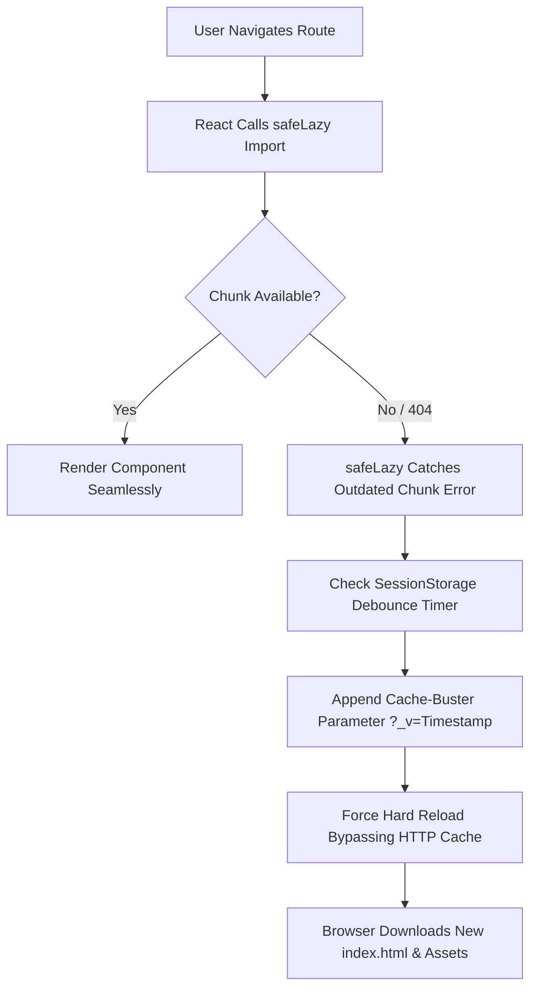

# Post-Deployment Dynamic Import & Stale Chunk Error Recovery

**Date:** 2026-08-12  
**Component:** Frontend (`App.tsx`, `ErrorBoundary.tsx`, `main.tsx`)  
**Status:** Implemented & Verified  

---

## 1. Executive Summary & Problem Description

### Symptom
When users (or developers) were actively using the application in an open browser tab while a new deployment occurred, navigating to lazy-loaded pages (such as `/dashboard`, `/profile`, `/rewards`, `/my-tests`) produced an "Application Notice" error popup:

```text
TypeError: Cannot read properties of undefined (reading 'default')
```

Even after clicking **Reload Page**, the same error modal continued to display repeatedly.

---

## 2. Root Cause Analysis

### A. Vite Chunk Hash Invalidation
During `npm run build`, Vite produces code-split JavaScript chunks with content-hashed filenames:
- Old Build Chunk: `assets/TeacherDashboard-DJ1-nPmj.js`
- New Build Chunk: `assets/TeacherDashboard-Kn3owXo2.js`

When a deployment completes, the hosting server deletes/replaces the old chunk files with the new build assets.

### B. Open Tab Memory Mismatch
If a user keeps a tab open from *before* the deployment, their browser holds in memory the old `index.html` file referencing `assets/TeacherDashboard-DJ1-nPmj.js`.

When navigating to a lazy-loaded route:
1. React triggers `React.lazy(() => import('./components/dashboard/TeacherDashboard'))`.
2. The browser requests `assets/TeacherDashboard-DJ1-nPmj.js`.
3. The server returns a `404 Not Found` (or HTML fallback).
4. The dynamic `import()` fails to resolve to a valid module object, evaluating to `undefined`.
5. React attempts to access `module.default` on `undefined`, raising `TypeError: Cannot read properties of undefined (reading 'default')`.

### C. Error Boundary & Cache Loop
1. **Uncaught Error String**: Chrome/Firefox format `TypeError: Cannot read properties of undefined (reading 'default')` was not matched by `ErrorBoundary.tsx`'s original regex checks (which only looked for `ChunkLoadError` or `Failed to fetch dynamically imported module`).
2. **HTTP Disk Cache**: Standard `window.location.reload()` re-requested `index.html` using browser HTTP disk cache, repeatedly serving the old cached `index.html` pointing to missing chunks.

---

## 3. Solution Architecture

We implemented a two-tiered, self-healing recovery system:



### 1. Resilient Component Loader (`safeLazy` in `App.tsx`)
All route components loaded with `lazy()` are wrapped with `safeLazy`:

```typescript
const safeLazy = <T extends React.ComponentType<any>>(
  factory: () => Promise<{ default: T } | any>
) => {
  return lazy(async () => {
    try {
      const module = await factory();
      if (module && module.default) {
        return module;
      }
      if (module && typeof module === 'object') {
        return { default: module.default || module };
      }
      throw new Error("Module export is invalid");
    } catch (error: any) {
      console.warn("Dynamic import failed (chunk outdated after deployment), auto-reloading page...", error);
      const storageKey = 'safe_lazy_reload_' + window.location.pathname;
      const now = Date.now();
      const lastReload = Number(sessionStorage.getItem(storageKey) || 0);
      if (now - lastReload > 8000) {
        sessionStorage.setItem(storageKey, String(now));
        const url = new URL(window.location.href);
        url.searchParams.set('_v', now.toString());
        window.location.href = url.toString();
      }
      throw error;
    }
  });
};
```

### 2. Enhanced Error Boundary (`ErrorBoundary.tsx`)
Expanded error pattern detection in `ErrorBoundary.tsx` to ensure any uncaught module loading error triggers a cache-busting hard reload:

```typescript
const errorMsg = error?.message || error?.toString() || '';
const isChunkError =
  error?.name === 'ChunkLoadError' ||
  errorMsg.includes('Failed to fetch dynamically imported module') ||
  errorMsg.includes('Importing a module script failed') ||
  errorMsg.includes('Loading chunk') ||
  errorMsg.includes("reading 'default'") ||
  errorMsg.includes('reading "default"') ||
  errorMsg.includes("property 'default' of undefined") ||
  errorMsg.includes("Cannot read properties of undefined") ||
  errorMsg.includes("Failed to load module script");

if (isChunkError) {
  const storageKey = 'last_chunk_error_reload';
  const now = Date.now();
  const lastReload = Number(sessionStorage.getItem(storageKey) || 0);
  if (now - lastReload > 8000) {
    sessionStorage.setItem(storageKey, String(now));
    const url = new URL(window.location.href);
    url.searchParams.set('_v', now.toString());
    window.location.href = url.toString();
  }
}
```

### 3. Cache-Busting Reload Handler
Both auto-recovery and manual click of the **Reload Page** button now modify `window.location.href` with `?_v=${Date.now()}`:

```typescript
private handleReload = () => {
  const url = new URL(window.location.href);
  url.searchParams.set('_v', Date.now().toString());
  window.location.href = url.toString();
};
```

---

## 4. How to Add New Lazy Loaded Pages

When adding a new route/page in `App.tsx`, **always** use `safeLazy` instead of `lazy`:

```typescript
// ✅ CORRECT
const MyNewPage = safeLazy(() => import("./pages/MyNewPage"));

// ❌ INCORRECT (vulnerable to post-deployment chunk errors)
const MyNewPage = lazy(() => import("./pages/MyNewPage"));
```

---

## 5. Verification Checklist

- [x] Code builds clean (`npm run build`).
- [x] `safeLazy` automatically catches missing chunk failures.
- [x] Browser HTTP cache loop prevented via `?_v=timestamp` query param.
- [x] `ErrorBoundary.tsx` fallback catches edge-case dynamic import errors.
- [x] SessionStorage debouncing prevents infinite reload loops.
