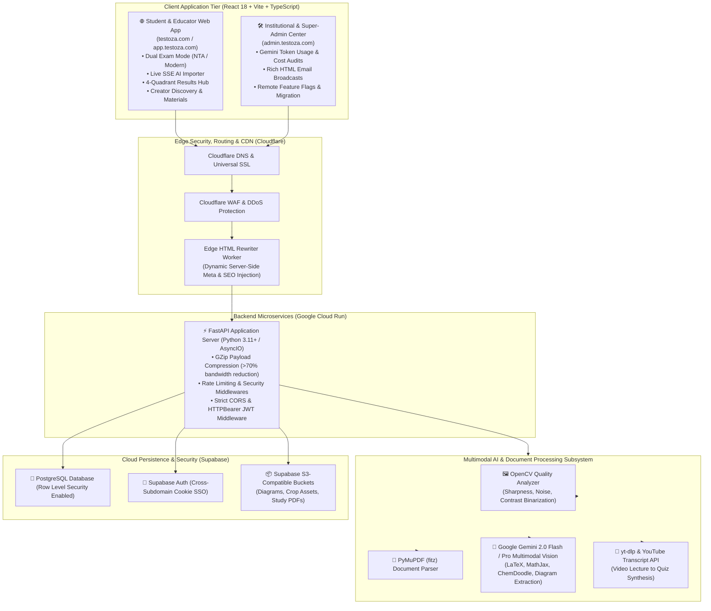

# 🎓 TestoZa — In-Depth Platform Analysis, Feature Extraction & Market Blueprint

> **"Auto-Create. Conduct. Analyze. Scale."**  
> *A comprehensive architectural and functional analysis of TestoZa — the AI-first Computer-Based Testing (CBT) infrastructure, cognitive diagnostics engine, and creator platform tailored for educators, coaching institutes, and competitive exam aspirants.*

---

## 📌 Table of Contents
1. [Executive Summary & Macro Market Context](#1-executive-summary--macro-market-context)
   - [The Great Indian CBT Shift (NTA, NEET, JEE, CUET, SSC, Banking)](#the-great-indian-cbt-shift)
   - [The Crisis of Paper-Based Testing in Coaching Institutes](#the-crisis-of-paper-based-testing-in-coaching-institutes)
   - [TestoZa Mission & Founding Context](#testoza-mission--founding-context)
2. [End-to-End System & Architecture Overview](#2-end-to-end-system--architecture-overview)
3. [Exhaustive Feature Extraction & Deep-Dive](#3-exhaustive-feature-extraction--deep-dive)
   - [Pillar 1: Multimodal Vision AI Test Creator & Document Digitizer](#pillar-1-multimodal-vision-ai-test-creator--document-digitizer)
   - [Pillar 2: Exam Building, Sectional Configuration & Multi-Paper Sessions](#pillar-2-exam-building-sectional-configuration--multi-paper-sessions)
   - [Pillar 3: High-Stakes Proctored CBT Engine (NTA & Modern Modes)](#pillar-3-high-stakes-proctored-cbt-engine-nta--modern-modes)
   - [Pillar 4: Deep Cognitive Diagnostics & 4-Quadrant Behavioral Analytics](#pillar-4-deep-cognitive-diagnostics--4-quadrant-behavioral-analytics)
   - [Pillar 5: Institutional Administration, White-Labeling & Batches](#pillar-5-institutional-administration-white-labeling--batches)
   - [Pillar 6: Content Distribution, Community, News & Gamification](#pillar-6-content-distribution-community-news--gamification)
   - [Pillar 7: Super-Admin Telemetry, AI Auditing & Broadcast Suite](#pillar-7-super-admin-telemetry-ai-auditing--broadcast-suite)
   - [Pillar 8: Enterprise Security, Reliability & Resilience Infrastructure](#pillar-8-enterprise-security-reliability--resilience-infrastructure)
4. [Comparative Value Matrix (TestoZa vs. Alternatives)](#4-comparative-value-matrix-testoza-vs-alternatives)
5. [Marketing & Social Media Gap Analysis (Codebase vs. LinkedIn/Facebook)](#5-marketing--social-media-gap-analysis-codebase-vs-linkedinfacebook)
   - [What Has Been Posted on LinkedIn](#what-has-been-posted-on-linkedin)
   - [Unleveraged Hidden Gems in the Codebase for Future Posts](#unleveraged-hidden-gems-in-the-codebase-for-future-posts)
   - [Ready-to-Publish Content Calendar & Hooks](#ready-to-publish-content-calendar--hooks)
6. [Conclusion & Next Strategic Horizons](#6-conclusion--next-strategic-horizons)

---

## 1. Executive Summary & Macro Market Context

### The Great Indian CBT Shift

India is witnessing one of the world's largest transitions toward standardized digital assessment:
- **National Testing Agency (NTA)** conducts flagship national entrance examinations (**JEE Main, CUET, UGC-NET, CSIR-NET, CMAT, GPAT**) purely as **Computer-Based Tests (CBT)**.
- **NEET-UG Transition**: Following controversies and logistics overhead surrounding paper leaks and physical exam security, official government initiatives and high-level committees (including partnerships with AICTE to identify thousands of government engineering colleges and polytechnics as Standard Testing Centres) are actively migrating or exploring CBT/hybrid digital formats.
- **Other National Bodies**: **Staff Selection Commission (SSC)**, **Banking (IBPS, SBI)**, **Railways (RRB)**, **GATE**, and **CAT** are 100% online CBT exams.

```
┌────────────────────────────────────────────────────────────────────────────────────────┐
│                              THE INDIAN CBT PARADOX                                    │
│                                                                                        │
│   NATIONAL EXAM REALITY                          GROUND LEVEL COACHING REALITY         │
│   ┌────────────────────────────────┐            ┌────────────────────────────────┐     │
│   │  • 100% Digital Screen CBT     │            │  • Physical Paper Question Sets│     │
│   │  • Live Countdown Timers       │    VS      │  • Manual OMR Sheet Bubbling   │     │
│   │  • 5-Color Question Palettes   │            │  • Days of Manual Checking     │     │
│   │  • Negative Marking Traps      │            │  • Generic Raw Score (72/100)  │     │
│   │  • On-screen Calculators       │            │  • Zero Time Analytics         │     │
│   └────────────────────────────────┘            └────────────────────────────────┘     │
│                                                                                        │
│               👉 Test-day shock: Students fail due to digital panic,                   │
│                  poor time-allocation, and lack of CBT muscle-memory.                  │
└────────────────────────────────────────────────────────────────────────────────────────┘
```

### The Crisis of Paper-Based Testing in Coaching Institutes

Over **500,000 coaching centers, tutorials, and solo educators** across Tier 1, Tier 2, and Tier 3 Indian cities prepare millions of students for these exams. However, the vast majority still rely on pen-and-paper exams due to the complexity and high cost of legacy enterprise LMS platforms.

#### The 14-Hour Educator Bottleneck (Per Single Test):
1. **Paper Compilation (2 hours)**: Formatting equations, cutting/pasting diagrams, structuring options.
2. **Typesetting & Proofing (1 hour)**: LaTeX formatting, ensuring print margins.
3. **Printing & Distribution (1 hour)**: Physical xeroxing, collating pages, handling reams of paper.
4. **Manual Checking & Grading (8 hours)**: Evaluating 60–100 student answer sheets manually.
5. **Score Tabulation & Rank Cards (2 hours)**: Calculating negative marks, entering scores in Excel, computing percentages.
* **Total Time Wasted: ~14 hours per test.** With TestoZa, this is compressed into **under 10 minutes**.

#### The Direct Financial & Pedagogical Toll:
- **Massive Printing Overhead**: Thousands of rupees spent weekly on toner cartridges, paper reams, and xerox shops.
- **Lagged Feedback Loop**: 3 to 7 days to return graded papers. By the time students receive their papers, the conceptual learning window has closed.
- **Exam-Day Panic**: Students comfortable with paper panic when facing on-screen countdowns, digital palettes, and screen-reading fatigue during real NTA exams.
- **Zero Behavioral Diagnostics**: Paper tests provide only a raw score (e.g. `140/300`). They cannot reveal **which questions acted as time traps**, **which questions were reckless silly mistakes**, or **where blind guessing occurred**.

### TestoZa Mission & Founding Context
- **Origins**: Founded by students from **IIT Madras** (incubated at Nirmaan, Sudha & Shankar Innovation Hub, IIT Madras, Chennai).
- **Core Philosophy**: **"The Educator's Choice"** — Build an intuitive, zero-setup, AI-native assessment and cognitive diagnostics platform that democratizes national-standard CBT testing for every coaching institute, school, and independent tutor in India.

---

## 2. End-to-End System & Architecture Overview

TestoZa operates on a modern, decoupled micro-application and serverless cloud architecture:



---

## 3. Exhaustive Feature Extraction & Deep-Dive

---

### Pillar 1: Multimodal Vision AI Test Creator & Document Digitizer
*Primary Locations: `/generate-with-ai`, `/convert`, `backend/ai_preview_importer/`, `backend/app/routers/ai.py`*

```
┌─────────────────────────────────────────────────────────────────────────────────────────┐
│                          MULTIMODAL AI TEST CONVERTER PIPELINE                          │
│                                                                                         │
│  [ Upload PDF / Image ] ──▶ [ OpenCV Quality Check ] ──▶ [ Gemini Multimodal Vision ]   │
│                                (Contrast, Sharpness)         (MathJax, LaTeX, Chem)     │
│                                                                        │                │
│  ┌─────────────────────────────────────────────────────────────────────┴─────────────┐  │
│  ▼                                                                                   ▼  │
│  【 Extract Mode 】                                                   【 Generate Mode 】 │
│  • Verbatim OCR + Diagram Cropping                                    • Conceptual Quiz │
│  • Cross-Page Question Stitching                                      • Level Synthesis │
│  • Disconnected Answer Key Matcher                                    • Custom Prompts  │
│  └──────────────────────────────────┬────────────────────────────────────────────────┘  │
│                                     ▼                                                   │
│                     [ Live SSE Real-Time Stream ]                                       │
│                                     ▼                                                   │
│               [ Interactive Visual Review & Editing Grid ]                              │
│                                     ▼                                                   │
│                      [ 1-Click Publish to Live CBT ]                                    │
└─────────────────────────────────────────────────────────────────────────────────────────┘
```

#### 1. Deep Computer Vision Pre-Processing (`quality_analyzer.py`)
- **Automatic Quality Scoring**: Evaluates uploaded images and PDF renders for blurriness, contrast levels, and DPI quality before feeding to LLMs.
- **Dynamic Pre-processing**: Auto-adjusts contrast thresholds, applies Otsu binarization, and denoises low-light mobile photos taken by teachers in classrooms.

#### 2. Multimodal OCR & STEM Notation Engine (`pdf_vision_pipeline.py`)
- **LaTeX & KaTeX Formula Extraction**: Flawlessly transcribes complex calculus ($\int_0^\pi \sin^2(x) dx$), multi-level fractions, matrices, determinants, and algebraic roots.
- **Chemistry & Diagram Recognition**: Recognizes chemical equations, reaction arrows, equilibrium symbols, and scientific subscripts/superscripts. ChemDoodle integration for structural chemistry.
- **Automated Diagram Cropping & CDN Upload**: Identifies question diagrams (geometric figures, electric circuits, mechanics free-body diagrams, graphs), crops them with precision bounding boxes, uploads them to cloud storage, and embeds responsive CDN URLs.

#### 3. Intelligent Structure Stitching & Answer Resolution
- **Cross-Page Question Stitching**: Rebuilds questions and options that are split across page boundaries without truncating context.
- **Disconnected Answer Key Auto-Matcher**: Analyzes multi-page papers where the question bank is on pages 1–8 and the answer key / solution table is placed on page 9–10, automatically joining each question to its correct key and explanation.

#### 4. Dual Operational AI Modes
- **Extract Mode**: 100% faithful, verbatim extraction of existing printed or handwritten mock papers.
- **Generate Mode**: Generates brand-new, syllabus-aligned questions, options, distractors, and step-by-step explanations from reference textbook pages or chapter notes.

#### 5. YouTube Lecture-to-Test Converter (`YouTubeGenerator.tsx`, `routers/ai.py`)
- **Lecture Video URL Ingestion**: Teachers or students paste any YouTube educational lecture link.
- **Automated Transcript Extraction**: Fetches and parses transcripts using `youtube-transcript-api` and fallback `yt-dlp`.
- **Note Summarization & Quiz Generation**: Generates structured revision notes, key formulas, and an interactive 10–25 question quiz assessing the core concepts taught in the video.

#### 6. Live Streaming SSE & Interactive Review Grid
- **Server-Sent Events (SSE) Stream**: Real-time progress bar with live extraction status (e.g. "Analyzing Page 3/10...", "Extracting LaTeX formulas...", "Matching Answer Key...").
- **Full Review Grid**: Educators can edit question prompts, correct math formulas using the built-in Math keyboard, change option labels, swap answer keys, adjust individual marks, and reorder questions before publishing.

---

### Pillar 2: Exam Building, Sectional Configuration & Multi-Paper Sessions
*Primary Locations: `/create-test`, `/edit-test/:id`, `/create-combined-test`, `TestBuilder.tsx`, `TestSettingsPanel.tsx`*

```
┌────────────────────────────────────────────────────────────────────────────────────────┐
│                        COMPLEX TEST CONFIGURATION CAPABILITIES                         │
│                                                                                        │
│  ┌──────────────────────┐  ┌──────────────────────┐  ┌──────────────────────────────┐  │
│  │ Question Archetypes  │  │ Sectional Engine     │  │ Combined Exam Sessions       │  │
│  │ • SCQ (Single)       │  │ • Physics Sec A & B  │  │ • JEE Adv Paper 1 + Paper 2  │  │
│  │ • MCQ (Partial Mark) │  │ • Chemistry          │  │ • Synchronized Break Timer   │  │
│  │ • Numerical Range    │  │ • Mathematics        │  │ • Combined Rank & Roster     │  │
│  │ • Matrix Match       │  │ • Custom + / - Marks │  │ • Consolidated Analytics     │  │
│  └──────────────────────┘  └──────────────────────┘  └──────────────────────────────┘  │
└────────────────────────────────────────────────────────────────────────────────────────┘
```

#### 1. Rich Question Archetypes Supported
1. **Single Choice Questions (SCQ)**: Traditional 4-option single correct answer.
2. **Multiple Correct Questions (MCQ) with JEE Advanced Partial Marking**:
   - *Full Marks* ($+4$): All correct options selected, no incorrect option selected.
   - *Partial Marks* ($+3, +2, +1$): Selected a subset of correct options without choosing any wrong option.
   - *Negative Penalty* ($-2$): Any incorrect option selected.
3. **Numerical Value Questions**:
   - Supports exact float matching (e.g., `3.14`).
   - **Numerical Range Matching**: Supports tolerance bounds (e.g., $[3.14, 3.16]$) to accommodate rounding variations during calculation.
4. **Matrix Match & Assertion-Reasoning**: Multi-column association and multi-statement validation questions.
5. **Image-Based Questions & Image Options**: Full support for rich diagrams in both question stems and individual options.

#### 2. Subject Sections & Marking Overrides
- **Multi-Subject Sectioning**: Organize tests into subjects (e.g. Physics, Chemistry, Mathematics, Biology) and sub-sections (e.g. Physics Section A [MCQ] & Section B [Numerical]).
- **Granular Marking Schemes**: Custom positive and negative marks per section or per individual question (e.g. $+4/-1$, $+3/-1$, $+2/0$, $+4/-2$).
- **AI Topic Auto-Assign**: 1-click semantic categorization that scans question text and auto-tags topics (e.g. "Rotational Mechanics", "Thermodynamics", "Organic Reaction Mechanisms").

#### 3. Combined Multi-Paper Exam Flow (`CreateCombinedTestPage.tsx`, `CombinedBreakScreen.tsx`)
- **Simulate Two-Session National Exams**: Modeled after JEE Advanced (Paper 1 in the morning $\rightarrow$ mandatory synchronized rest interval $\rightarrow$ Paper 2 in the afternoon).
- **Synchronized Break Screen**: Displays countdown clock, instructions, and rest alerts.
- **Consolidated Merit List & Rank Card**: Automatically aggregates scores from both sessions into unified percentile and subject-wise rank reports.

#### 4. Instant Test Cloning & Customization (`CloneTestDialog.tsx`)
- Educators can clone any existing public or self-created test in 1 click to create a variation, modify questions, or change marking rules for a new batch.

---

### Pillar 3: High-Stakes Proctored CBT Engine (NTA & Modern Modes)
*Primary Locations: `/live/:id`, `/test/:slug`, `TestPage.tsx`, `ConductExamDialog.tsx`*

```
┌─────────────────────────────────────────────────────────────────────────────────────────┐
│                                DUAL EXAM INTERFACE MODES                                │
│                                                                                         │
│  【 NTA STANDARD MODE 】                                【 MODERN CLEAN MODE 】         │
│  • Authentic NTA Exam Palette                           • Distraction-free, minimal     │
│  • 5-State Question Indicator:                          • Apple/Notion SaaS styling     │
│    ⚪ Not Visited (Gray)                                 • Optimized for mobile devices  │
│    🔴 Not Answered (Orange/Red)                         • Clean swipeable question flow │
│    🟢 Answered (Green)                                  • Fluid floating palette        │
│    🟣 Marked for Review (Purple)                                                       │
│    🟣+🟢 Answered & Marked for Review (Purple+Dot)                                      │
└─────────────────────────────────────────────────────────────────────────────────────────┘
```

#### 1. Dual Exam Interface Layouts
- **NTA Standard Mode**: 100% authentic replication of the official NTA computer-based examination console (question header, candidate info, countdown timer, question palette, status summary). Prepares students mentally for the real test.
- **Modern Mode**: Minimal, clean UI with frosted glass aesthetics, perfect for daily homework quizzes, coaching mock series, and mobile smartphone test-taking.

#### 2. Comprehensive Anti-Cheating & Proctoring Suite
- **Fullscreen Lockdown**: Enforces full-screen mode before opening the exam. Exiting fullscreen immediately triggers an on-screen warning and logs a violation.
- **Tab & App Switch Detection**: Listens to `visibilitychange` and window blur events. Detects when a student switches tabs, opens search engines, or minimizes the browser.
- **Configurable Violation Actions**:
  - *Warn Only*: Displays warning dialogs with strike counters.
  - *Strict Mode*: Instantly auto-submits the exam on the very first violation.
  - *N-Strike Threshold*: Configurable warning limit (e.g., 2, 3, or 5 strikes) before automatic exam termination and submission.
- **Content & Shortcut Protection**: Disables mouse right-click context menus, blocks clipboard copy (`Ctrl+C`), paste (`Ctrl+V`), inspection (`F12`), text selection, and browser back-button navigation.
- **Disable Exit Button Option**: Removes the manual exit button to ensure candidates cannot abandon or peek at questions without a formal submission.

#### 3. Virtual Scientific Calculator (`ScientificCalculator.tsx`)
- Floating, drag-enabled scientific calculator embedded directly inside the exam console for advanced trigonometry, logarithms, powers, and roots (matching GATE and national exam conditions).

#### 4. Pre-Exam Candidate Start Form & Access Controls
- **Customizable Start Forms**: Teachers can require students to input custom metadata before starting (e.g. Student Name, Roll Number, Coaching Batch, Phone Number, College ID).
- **Mandatory Login Enforcement (`login_required`)**: Toggle to require students to log in with an account, ensuring results are saved permanently to their personal profile.
- **Single vs Unlimited Attempt Limit**: Restrict students to exactly 1 attempt to prevent trial-and-error peeking.
- **Scheduled Testing Windows**: Lock the test to start at a specific date/time (e.g. Sunday 10:00 AM) and expire at an end date/time (Sunday 1:00 PM).

#### 5. Disaster Recovery & Offline Session Resilience
- **Double-Buffered Snapshotting**: Every question visit, option select, time tick, and review flag is synchronously backed up to both `localStorage` and `sessionStorage`.
- **Periodic Background Sync**: Periodically syncs state with the backend.
- **Crash & Power-Cut Recovery**: If a student's computer shuts down, browser crashes, or internet disconnects, reopening the link restores their exact remaining time, selected answers, and palette status without losing a single mark.

---

### Pillar 4: Deep Cognitive Diagnostics & 4-Quadrant Behavioral Analytics
*Primary Locations: `/results/:id`, `/results/solutions/:testId`, `/test-analysis/:testId`, `FullTestAnalysisPage.tsx`, `BehavioralTimeMatrix.tsx`, `StudentDetailedResultModal.tsx`*

```
┌─────────────────────────────────────────────────────────────────────────────────────────┐
│                      4-QUADRANT BEHAVIORAL TIME & ACCURACY MATRIX                       │
│                                                                                         │
│     HIGH ACCURACY (CORRECT)                 HIGH ACCURACY (CORRECT)                     │
│     ⚡ FAST SOLVE TIME                       ⏳ SLOW SOLVE TIME                         │
│     ┌─────────────────────────────┐         ┌─────────────────────────────┐             │
│     │   🟢 DIRECT RECALL/MASTERY  │         │   🟡 DEEP THINKER/DILIGENT  │             │
│     │   Strong conceptual grasp;  │         │   Solved correctly but took │             │
│     │   answers instinctively.    │         │   excessive problem time.   │             │
│     └─────────────────────────────┘         └─────────────────────────────┘             │
│                                                                                         │
│     LOW ACCURACY (WRONG)                    LOW ACCURACY (WRONG)                        │
│     ⚡ FAST SOLVE TIME                       ⏳ SLOW SOLVE TIME                         │
│     ┌─────────────────────────────┐         ┌─────────────────────────────┐             │
│     │   🔴 RECKLESS/CARELESS SLIP │         │   ⚫ TIME TRAP/HIGH ANXIETY │             │
│     │   Rushed through question;  │         │   Spent maximum time only   │             │
│     │   careless reading/guess.   │         │   to get negative marks!    │             │
│     └─────────────────────────────┘         └─────────────────────────────┘             │
└─────────────────────────────────────────────────────────────────────────────────────────┘
```

#### 1. The 4-Quadrant Behavioral Matrix (Apple iOS Health-Style Widgets)
Instead of a simple score sheet, TestoZa classifies every single question attempt into one of four cognitive behavioral archetypes:
1. 🟢 **Direct Recall / Concept Mastery (Fast & Accurate)**: Questions answered quickly and correctly. Reflects genuine conceptual fluency.
2. 🟡 **Deep Thinker / Diligent (Slow & Accurate)**: Questions answered correctly but took 2x–3x the median time. Shows strong fundamentals but highlights the need for shortcut techniques and speed drills.
3. 🔴 **Reckless / Careless Slips (Fast & Wrong)**: Questions answered in seconds and marked wrong. Highlights rushed reading, arithmetic errors, or hasty guessing.
4. ⚫ **Time Traps (Slow & Wrong)**: The single largest reason for exam failure. Questions where the student wasted 4–8 minutes struggling, only to end up with negative marks.

#### 2. Advanced Diagnostic Metrics
- **Blind Guess Detection Engine**: Flags anomalous rapid selections on high-difficulty questions where the solve time is statistically insufficient for problem computation.
- **Speed vs. Accuracy Correlation Curves**: Plots answer correctness against time spent to find the student's optimum decision-making pace.
- **Section Radar & Topic Diagnostic Maps**: Visual spider/radar charts displaying strengths and vulnerabilities across subjects and micro-topics.
- **Difficulty Strike Rate**: Performance broken down by question difficulty (Easy, Medium, Hard).

#### 3. Solution Hub & Video Walkthroughs (`SolutionsViewPage.tsx`, `SolutionEditorPage.tsx`)
- Step-by-step written explanations rendered with full KaTeX math formatting.
- Integrated video solution links (YouTube/Vimeo) embedded directly inside each question review card.

#### 4. Dedicated Institutional Roster & Class Analytics (`FullTestAnalysisPage.tsx`)
For educators and coaching administrators:
- **Class-wide 2x2 Learning Cohort Matrix**: Categorizes the entire student batch into four cohorts: *Mastery Cohort*, *Deep Thinkers*, *Impulsive Guessers*, and *At-Risk Cohort*.
- **Question Discrimination Index & Distractor Analysis**: Reveals which question options misled the most students and identifies poorly phrased questions.
- **Live Leaderboards & Rank Cards**: Complete class rank lists, percentile calculations, and total time taken.
- **Individual Candidate Drill-Down Modal (`StudentDetailedResultModal.tsx`)**: Inspect any individual student's question-by-question timeline, clicks, violations, and responses.
- **One-Click Export**: Export complete test results, student data, and marks to CSV/Excel.

---

### Pillar 5: Institutional Administration, White-Labeling & Batches
*Primary Locations: `UserTestManager.tsx`, `TeacherDashboard.tsx`, `ConductExamDialog.tsx`, `lib/classesApi.ts`*

- **Teacher & Institutional Dashboard (`/dashboard`)**: Dedicated interface for educators to manage question banks, review student submissions, track active batches, and schedule exams.
- **Institutional Branding & Custom White-Labeling**: Embed the institute's name and logo watermark onto the live test console, candidate instructions, and downloadable result cards.
- **Controlled Result Release**: Choose between:
  - *Instant Feedback*: Students see their detailed scorecard and solutions immediately upon submission.
  - *Delayed / Locked Release*: Results remain hidden until the teacher reviews the batch and manually unlocks them at a designated date/time.
- **Batch / Class Management (`/classes`)**: Group tests into distinct batches (e.g. "JEE 2027 Dropper Batch", "Class 12 Medical Batch A").
- **Test Visibility & Privacy Controls**:
  - *Public*: Discoverable on the TestoZa global feed.
  - *Unlisted / Private Link*: Accessible only via direct URL or secret passkey.

---

### Pillar 6: Content Distribution, Community, News & Gamification
*Primary Locations: `/materials`, `/news`, `/blog`, `/rewards`, `MaterialsManager.tsx`, `NewsFeed.tsx`, `RewardsPage.tsx`*

- **Study Materials Repository (`/materials`)**: Centralized portal for educators and creators to upload and share formula sheets, chapter mind-maps, and revision notes with categorized PDF viewers.
- **Educational NewsFeed & Blog Engine (`/news`, `/blog`)**: Integrated publishing system with a rich TipTap editor (supporting tables, formatted code blocks, KaTeX math, and resizable media) for syllabus updates, exam alerts, and strategy guides.
- **Gamification & Daily Streaks (`/rewards`)**: Daily test practice streaks, performance XP points, platform coins, and achievement badges to maximize daily student engagement.
- **Public Creator Profiles (`/creator/:id`)**: Verified creator profiles displaying published tests, total attempts, upvotes, follower counts, and educator bios.

---

### Pillar 7: Super-Admin Telemetry, AI Auditing & Broadcast Suite
*Primary Locations: `frontend-admin/src/pages/`, `AdminAiAuditPanel.tsx`, `AdminEmailBroadcastPanel.tsx`, `AdminFeatureControlPanel.tsx`*

```
┌────────────────────────────────────────────────────────────────────────────────────────┐
│                                ADMIN CONTROL CENTER                                    │
│  ┌───────────────────────────┐   ┌───────────────────────────┐   ┌───────────────────┐ │
│  │   AI Token Usage Audit    │   │  Email Broadcast Manager  │   │  Dynamic Remote   │ │
│  │  Track cost/tokens per job│   │  Segmented HTML campaigns │   │  Feature Flags    │ │
│  └───────────────────────────┘   └───────────────────────────┘   └───────────────────┘ │
│  ┌───────────────────────────┐   ┌───────────────────────────┐   ┌───────────────────┐ │
│  │   Test & Content Mod      │   │  Promo Codes & Pricing    │   │  System Migration │ │
│  │  Approve / edit / moderate│   │  Discounts, tiers & plans │   │  & Database Ops   │ │
│  └───────────────────────────┘   └───────────────────────────┘   └───────────────────┘ │
└────────────────────────────────────────────────────────────────────────────────────────┘
```

- **AI Token & Cost Audit Panel (`AdminAiAuditPanel.tsx`)**: Real-time observability over Google Gemini API calls, token counts per document, processing latencies, model breakdown, and operational costs.
- **Segmented Email Broadcast Engine (`AdminEmailBroadcastPanel.tsx`)**: Send custom HTML email announcements to all users, active test takers, or creators with deliverability tracking.
- **Remote Dynamic Feature Flags (`AdminFeatureControlPanel.tsx`)**: Enable or disable specific platform modules (AI Importer, Proctored mode, Newsfeed, Gamification) instantly across production without requiring code redeployments.
- **Commercial Management & Promo Codes (`AdminPricingPanel.tsx`, `AdminPromoCodesPanel.tsx`)**: Manage subscription tiers, discount coupons, and payment auditing.
- **Database Migrations & Ops Panel (`AdminMigrationPanel.tsx`)**: Run administrative migrations and database consistency checks.

---

### Pillar 8: Enterprise Security, Reliability & Resilience Infrastructure

- **Cross-Subdomain SSO (Single Sign-On)**: Seamless authentication cookie sharing across `testoza.com`, `app.testoza.com`, and `admin.testoza.com` with isolated role authorization.
- **Edge SEO & HTML Rewriter Worker (`cloudflare_worker_seo_html_rewriter.md`)**: Injects dynamic OpenGraph metadata, title tags, and rich schemas at the Cloudflare edge for instant social sharing previews on WhatsApp, Telegram, and LinkedIn.
- **Post-Deployment Dynamic Import Auto-Recovery (`safeLazy`)**: Transparently reloads chunks if a user is actively taking a test during a continuous deployment, preventing `ChunkLoadError` crashes.
- **Backend GZip Compression & Fast Response Times**: GZip compression cuts API response payloads by over 70%, ensuring lightning-fast loading on 3G/4G networks in rural areas.
- **Google Ads & Policy Hardening**: Clean routing architecture with dedicated landing pages (`/quiz-creator`, `/assessment-platform`), transparent terms, and zero cloaking.

---

## 4. Comparative Value Matrix (TestoZa vs. Alternatives)

| Feature / Capability | Paper & OMR Tests | Google / MS Forms | Generic LMS (Moodle) | Enterprise Testing Software | 🚀 **TestoZa** |
|:---|:---:|:---:|:---:|:---:|:---:|
| **Test Creation Time** | 3–5 Hours | 1–2 Hours | 2–4 Hours | 1–2 Hours | **⚡ < 60 Seconds (AI Vision)** |
| **STEM / LaTeX / Chemistry** | Manual typing | ❌ None | ⚠️ Plugin required | ⚠️ Complex setup | **✅ Native KaTeX & ChemDoodle** |
| **Diagram Extraction** | Manual Scissors/Scan | ❌ Manual upload | ❌ Manual upload | ❌ Manual upload | **✅ Auto Crop & Upload** |
| **YouTube to Test Quiz** | ❌ None | ❌ None | ❌ None | ❌ None | **✅ 1-Click Video Converter** |
| **NTA-Standard Exam UI** | ❌ None | ❌ None | ❌ None | ⚠️ Partial | **✅ Authentic NTA & Modern** |
| **JEE Advanced Partial Marking** | Manual grading | ❌ Impossible | ⚠️ Custom Scripting | ⚠️ Add-on cost | **✅ Built-in (+4, +3, +2, +1, -2)** |
| **Numerical Tolerance Ranges** | Manual grading | ❌ String match | ⚠️ Regex | ⚠️ Limited | **✅ Range Matching [x, y]** |
| **Anti-Cheat Proctoring** | Physical invigilator | ❌ Zero | ⚠️ External tool | 💰 Expensive add-on | **✅ Fullscreen, Tab & Blur Lock** |
| **4-Quadrant Time Diagnostics** | ❌ None | ❌ None | ❌ None | ❌ None | **✅ 4-Quadrant Behavioral Matrix** |
| **Blind Guess Detection** | ❌ None | ❌ None | ❌ None | ❌ None | **✅ Algorithmic Anomaly Flag** |
| **Institutional White-Labeling** | High printing cost | ❌ None | ⚠️ Heavy config | 💰 Enterprise pricing | **✅ Instant Logo & Brand Header** |
| **Crash & Offline Resilience** | N/A | ❌ Lost on refresh | ⚠️ Session drops | ⚠️ Variable | **✅ Double-Buffered Snapshots** |
| **Setup & Hosting Overhead** | High paper costs | None | High server costs | High IT setup | **✅ 100% Zero Setup Cloud SaaS** |

---

## 5. Marketing & Social Media Gap Analysis (Codebase vs. LinkedIn/Facebook)

### What Has Been Posted on LinkedIn
An analysis of public posts on the [TestoZa LinkedIn Page](https://www.linkedin.com/company/testoza/):
1. ✅ **Dual Exam Interface Layouts**: Introducing Standard Mode (NTA) vs Modern Mode.
2. ✅ **4-Quadrant Behavioral Time Matrix**: Fast & Accurate, Slow & Accurate, Fast & Careless, and Time Traps.
3. ✅ **The 14-Hour Teacher Time Crisis**: Breaking down paper creation, formatting, printing, and grading vs. AI automation.
4. ✅ **Why Scaling CBT in Tier-2/Tier-3 India is Hard**: Discussion on infrastructure bottlenecks and digital familiarity.
5. ✅ **Proctored Exams Guide**: Step-by-step security walkthrough (fullscreen, tab-switch detection).

---

### Unleveraged Hidden Gems in the Codebase for Future Posts

The codebase contains numerous sophisticated features that **have not yet been highlighted on LinkedIn, Facebook, or public media**. These represent immediate opportunities for high-engagement posts, product demos, and educator outreach:

```
┌────────────────────────────────────────────────────────────────────────────────────────┐
│                   UNLEVERAGED FEATURES READY FOR SOCIAL SPOTLIGHT                       │
│                                                                                        │
│  1. 🎥 YouTube Lecture to Test Converter (Instant Quiz from any lecture URL)           │
│  2. ✂️ Automated Visual Diagram Cropping (Graphs, Circuits, Geometry auto-extracted)   │
│  3. 📄 Disconnected Answer Key Auto-Matcher (Matches page 1 questions with page 10 key)│
│  4. 📐 Advanced JEE Numerical Range Matching (Accepts [3.14, 3.16] tolerance bounds)   │
│  5. ⚖️ JEE Advanced Complex Partial Marking (+4, +3, +2, +1, -2 algorithms)            │
│  6. 🔄 Combined Multi-Paper Exam Flow (JEE Adv Paper 1 ➔ Synchronized Break ➔ Paper 2) │
│  7. 🛡️ Double-Buffered Disaster Recovery (Zero data loss on power cut or crash)         │
│  8. 👥 Class-Wide 2x2 Pedagogical Learning Cohorts (Mastery vs At-Risk batch analytics)│
│  9. 🔒 Dynamic Pre-Exam Start Form (Capture Roll No, Batch, Phone with custom fields)  │
│ 10. 🏷️ AI Semantic Topic Tagging (1-click automatic chapter and topic classification)  │
└────────────────────────────────────────────────────────────────────────────────────────┘
```

---

### Ready-to-Publish Content Calendar & Hooks

#### 🎯 Post 1: The "YouTube Video into an Interactive Exam in 30 Seconds" Feature
- **The Hook**: *"Teachers: What if your students could watch a 45-minute YouTube lecture and immediately take a customized quiz to test their comprehension?"*
- **The Feature Highlight**: Showcase the `YouTubeGenerator.tsx` feature (`/generate-with-ai`). Paste any YouTube educational lecture link $\rightarrow$ AI extracts transcripts $\rightarrow$ Generates chapter revision notes $\rightarrow$ Builds an interactive quiz.
- **Target Audience**: Coaching faculties, EdTech creators, self-studying students.

#### 🎯 Post 2: The "Disconnected Answer Key" Miracle
- **The Hook**: *"Every teacher has tried OCR tools that fail because the questions are on Page 1 to 5, but the Answer Key is hidden in a table on Page 12. Here’s how we fixed it."*
- **The Feature Highlight**: Explain how TestoZa's Gemini Vision pipeline pairs separated question stems with distant answer key tables automatically.
- **Target Audience**: Coaching teachers converting past year papers (PYQs).

#### 🎯 Post 3: "Why JEE Advanced Partial Marking is Impossible on Google Forms"
- **The Hook**: *"Try setting up: '+4 for all correct, +3 if 4 are correct and 3 chosen, -2 for wrong' in Google Forms or standard quiz tools. You can't. That's why we built native JEE Advanced scoring into TestoZa."*
- **The Feature Highlight**: Explain the partial marking and numerical range tolerance engine ($[x_{min}, x_{max}]$).
- **Target Audience**: Premier JEE / NEET coaching institutes.

#### 🎯 Post 4: "The Power Cut Resilience: How TestoZa Survives Sudden Crashes"
- **The Hook**: *"In Tier-2 and Tier-3 towns, sudden power cuts and unstable Wi-Fi are a reality. What happens to an online test when the power goes off?"*
- **The Feature Highlight**: Detail the double-buffered `localStorage` + `sessionStorage` + background sync architecture that restores candidate time and answers instantly upon reboot.
- **Target Audience**: Institutional owners concerned about digital exam reliability.

#### 🎯 Post 5: "The 2-Session Combined Exam: Simulating JEE Advanced Paper 1 & 2"
- **The Hook**: *"Real exams aren't just 1 test. JEE Advanced is a 6-hour mental marathon with a mandatory break in between. TestoZa now supports full Multi-Session Combined Exams."*
- **The Feature Highlight**: Showcase `CreateCombinedTestPage.tsx` and `CombinedBreakScreen.tsx` with consolidated merit lists.
- **Target Audience**: IIT-JEE aspirants and premier coaching centers.

---

## 6. Conclusion & Next Strategic Horizons

TestoZa has evolved beyond a simple mock test maker into a **full-scale, enterprise-grade, AI-powered assessment ecosystem**. 

By addressing the specific pedagogical and operational pain points of Indian competitive exams (**JEE, NEET, CUET, SSC, Banking**) and eliminating the friction of manual paper testing, TestoZa bridges the digital divide for over **500,000 coaching centers and millions of aspirants**.

### 🚀 Summary of Key Strategic Differentiators:
1. **60-Second Vision AI Ingestion**: Zero-typing digitization of math, diagrams, and answer keys.
2. **Authentic National CBT Simulation**: Exact NTA standard interface + modern distraction-free mode.
3. **Cognitive Diagnostic Intelligence**: 4-Quadrant Behavioral Time Matrix that pinpoints *why* scores dropped, not just *what* dropped.
4. **Institutional Empowerment**: White-labeling, batch grouping, controlled result release, and single-click cloning.
5. **Rock-Solid Reliability**: Power-cut disaster recovery, anti-cheating proctoring, and Cloud Run serverless scale.

---

<div align="center">

**Document Created For**: TestoZa Platform Documentation  
**Author**: Antigravity AI (Pair-Programmed with Nirwair Kumar Chaudhary)  
**Location**: `documentation/platform_deep_analysis_and_features.md`  
**Live Platform**: [https://testoza.com](https://testoza.com) | **Admin Console**: [https://admin.testoza.com](https://admin.testoza.com)

</div>
