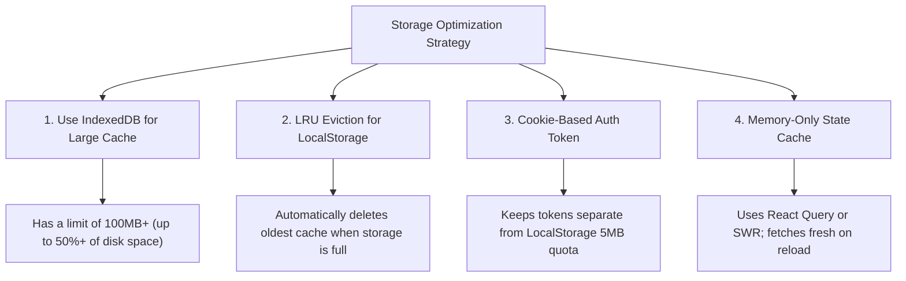

# 💾 Storage & Privacy Consent Analysis Report

This document provides a detailed analysis of the **LocalStorage Quota Exceeded** error, the role of cookies, and a privacy compliance assessment of how your website collects and stores user data.

---

## 1. Root Cause: Why did `QuotaExceededError` happen?

The error `Failed to execute 'setItem' on 'Storage': Setting the value of 'testoza_token' exceeded the quota.` occurs when the browser's **5MB LocalStorage limit** is breached for your origin (domain). 

When this limit is exceeded, any subsequent call to `localStorage.setItem()` throws a `QuotaExceededError` and fails—meaning even a tiny key like `testoza_token` (JWT token) cannot be stored.

### Does this happen when creating/viewing questions many times?
**Yes, absolutely.** The codebase actively caches large payloads in `localStorage`:
1. **Test Cache (`testsApi.ts`):** 
   ```typescript
   localStorage.setItem(`test_cache_${id}_eq_${excludeQuestions}`, JSON.stringify({ data, ts: Date.now() }));
   ```
   When creators or students view tests, the entire test object (containing titles, descriptions, settings, and **all questions, passages, options, and image URLs**) is cached in `localStorage` for 3 minutes. If a user views or edits multiple tests, each cache entry can easily be several hundred KB to over 1MB. Caching just 4–5 large tests will exhaust the 5MB limit.
2. **Draft Tests (`TestBuilder.tsx`):**
   ```typescript
   localStorage.setItem('create_test_draft', JSON.stringify(draftData));
   ```
   Saves full draft tests including all added questions.
3. **Test Session Progress (`TestPage.tsx`):**
   ```typescript
   localStorage.setItem(`test_session_${user.id}_${id}`, JSON.stringify(sessionData));
   ```
   Stores student answers, visited questions list, and state.

---

## 2. How Industry-Grade Websites Solve This Issue

High-scale web applications avoid using `localStorage` for caching large datasets. They resolve this using four primary strategies:



### 1. Shift Large Payloads to IndexedDB
`IndexedDB` is an asynchronous, transactional, and non-blocking database built into the browser. 
- **Quota:** Typically allows using up to **50% of the user's free disk space** (hundreds of megabytes or gigabytes).
- **Use Case:** Perfect for caching test details, offline-first exam drafts, and large questions. (Your application already uses IndexedDB for the `AnswerVault` in `testResilience.ts`—you should extend this to your test caches and builder drafts).

### 2. Implement Try-Catch & Eviction in LocalStorage
When writing to `localStorage`, code must defensively handle errors and evict old keys.
```typescript
export function safeSetItem(key: string, value: string) {
    try {
        localStorage.setItem(key, value);
    } catch (e) {
        if (e instanceof DOMException && (
            e.name === 'QuotaExceededError' ||
            e.name === 'NS_ERROR_DOM_QUOTA_REACHED'
        )) {
            // Evict test caches to free up space
            evictStaleCaches();
            try {
                localStorage.setItem(key, value); // Retry once
            } catch (retryError) {
                console.error("Storage full even after cache eviction");
            }
        }
    }
}

function evictStaleCaches() {
    // Look for keys starting with 'test_cache_' and remove them
    for (let i = 0; i < localStorage.length; i++) {
        const key = localStorage.key(i);
        if (key && key.startsWith('test_cache_')) {
            localStorage.removeItem(key);
        }
    }
}
```

### 3. Use Secure Cookies for Auth Tokens
Industry-grade websites store JWT tokens (`testoza_token`) in HTTP cookies rather than `localStorage`.
- **Separate Quota:** Cookies have their own quota (~4KB per cookie, up to 20+ cookies per domain), which is completely separate from `localStorage`'s 5MB.
- **Improved Security:** Storing tokens in `HttpOnly` and `Secure` cookies protects them from Cross-Site Scripting (XSS) attacks.

---

## 3. Cookie & Privacy Consent Audit (GDPR & ePrivacy Compliant)

You mentioned you have implemented features without asking for cookie consent. Let's analyze what data storage is **valid** (exempt from consent) and what is **invalid** (requires explicit consent) under modern regulations (like GDPR and the ePrivacy Directive).

### The Golden Rule of Consent
> [!IMPORTANT]
> The ePrivacy Directive ("Cookie Law") applies to **any storage or retrieval of information on a user's device** (e.g., `localStorage`, `sessionStorage`, `IndexedDB`, and browser fingerprinting). It is **not** limited to cookies.
> 
> Storage is exempt from consent **only** if it is **"strictly necessary"** to deliver a service explicitly requested by the user.

### ⚖️ Compliance Breakdown

| Data Stored / Processed | Storage Method | strictly necessary? | Consent Required? | Status / Legal Assessment |
| :--- | :--- | :---: | :---: | :--- |
| **Auth Tokens** (`testoza_token`) | `localStorage` | **Yes** | ❌ **No** | **Valid without consent.** Users must be authenticated to access their private dashboards and quizzes. |
| **Active Quiz Sessions** | `localStorage`/`IndexedDB` | **Yes** | ❌ **No** | **Valid without consent.** Saving live quiz answers is essential to ensure exam resilience against connectivity loss. |
| **Test Builder Drafts** | `localStorage` | **Yes** | ❌ **No** | **Valid without consent.** Prevents creators from losing their progress during question creation. |
| **Proctoring Logs & Warnings** | `localStorage` | **Yes** | ❌ **No** | **Valid without consent.** Essential for security, exam integrity, and fraud prevention as requested by test creators. |
| **Visual Themes** (`theme: 'dark'`) | `localStorage` | **Yes** | ❌ **No** | **Valid without consent.** Saves user preference UI configurations. |
| **Device Fingerprints for Traffic** | Memory/POST API | **No** |  **Yes** | **NOT COMPLIANT without consent.** Fingerprinting a browser to track analytics is legally equivalent to tracking cookies. Even though no PII or cookies are used, identifying a returning device for analytics requires consent in GDPR jurisdictions. |
| **Referrer/Campaign Tracking (UTMs)**| Query Params / POST | **No** |  **Yes** | **NOT COMPLIANT without consent.** Tracking where users came from for marketing/attribution statistics requires user consent. |

---

## 4. Code Remediation Plan

To resolve the quota issue permanently and secure consent correctly:

### Step A: Safely handle write failures in Caching
Modify `_setCachedTest` in `frontend/src/lib/testsApi.ts` to prevent crashing and automatically clean up expired or old test caches when space is tight:

```typescript
// Replace lines 452-456 in testsApi.ts with a self-cleaning cache helper:
function _setCachedTest(id: string, data: any, excludeQuestions: boolean = false) {
    const cacheKey = `test_cache_${id}_eq_${excludeQuestions}`;
    try {
        localStorage.setItem(cacheKey, JSON.stringify({ data, ts: Date.now() }));
    } catch (e) {
        if (e instanceof DOMException && e.name === 'QuotaExceededError') {
            // Quota reached: clear all test caches and retry
            console.warn('[testsApi] LocalStorage full. Evicting old test caches...');
            for (let i = localStorage.length - 1; i >= 0; i--) {
                const key = localStorage.key(i);
                if (key && key.startsWith('test_cache_')) {
                    localStorage.removeItem(key);
                }
            }
            try {
                // Retry saving this one
                localStorage.setItem(cacheKey, JSON.stringify({ data, ts: Date.now() }));
            } catch (retryError) {
                console.error('[testsApi] Failed to write cache even after eviction', retryError);
            }
        }
    }
}
```

### Step B: Move Large Session Drafts to IndexedDB (Recommended)
Just like `AnswerVault` uses IndexedDB to save answers:
- We can save `test_session_${user.id}_${id}` into IndexedDB instead of `localStorage` in `TestPage.tsx`. This completely eliminates the risk of exam drafts crashing due to full storage.

### Step C: Legally Compliant Privacy Notice
Because you use **Browser Fingerprinting** to track traffic (as detailed in `plans/visitor-analytics-plan.md` and `recycle/frontend_components/CookieConsent.tsx`), you **must** display the cookie consent banner to visitors from GDPR-regulated regions. 
- You should restore the `CookieConsent` banner on the main page.
- Do not run the tracking fingerprint API request until the user clicks **Accept** on the consent banner.

---

## 5. Actual Implementation Details

### Eviction Policy Implementation
On **June 26, 2026**, the `_setCachedTest` function in `frontend/src/lib/testsApi.ts` was refactored. The updated function intercepts any `QuotaExceededError` or related quota-exceeded exception from the browser during cache writes.

Upon interception:
1. It queries the `localStorage` key registry.
2. It isolates and purges all entries prefixed with `test_cache_` (which represent large cached quiz schemas).
3. It retries writing the current test page item.

This keeps critical data (such as auth tokens or active student session metrics) from failing to write due to local storage overflow.
