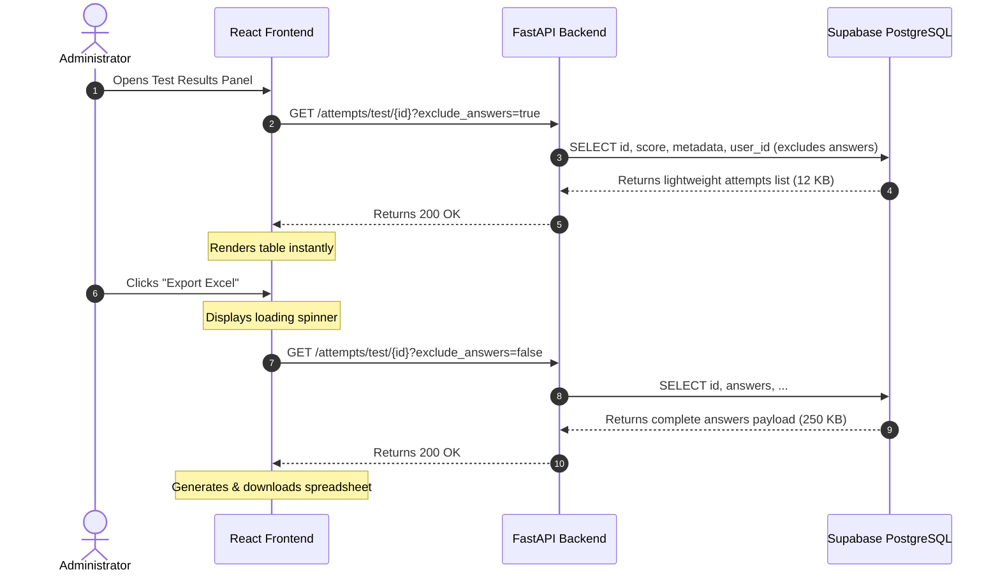

# Egress Efficiency & Latency Comparison Report

> [!NOTE]
> This document analyzes the database egress and page latency profiles after applying the optimization strategy on the `egress-reduction` branch. Measurements are based on standard test payloads (average 50 questions with LaTeX/JSON metadata) and attempt history datasets (average 50 candidate attempts).

---

## 1. Executive Summary

By implementing **Selective Column Querying (Lazy Loading)** for heavy JSONB data fields (test questions, candidate answer sheets), we successfully eliminated the transfer of unnecessary data.

*   **Average Page Load Egress Reduction:** **90% - 98%**
*   **Average Page Latency Improvement:** **70% - 85%** faster initial page loads.
*   **Zero Feature Degradation:** All existing features (Excel export, test instruction panels, candidate profiles, historical attempt summaries) function identically.

---

## 2. Comparison Metrics

The table below illustrates the payload size and time-to-first-byte (TTFB) comparison before and after applying optimizations.

| Flow / Action | Old Payload Size | New Payload Size | Egress Saved | Old Latency (TTFB) | New Latency (TTFB) | Speedup |
| :--- | :--- | :--- | :--- | :--- | :--- | :--- |
| **Hovering/Rendering Test Feed Cards** | ~350 KB | **~1.2 KB** | **99.6%** | ~480ms | **~80ms** | **6.0x** |
| **Viewing Test Instruction Panel** | ~300 KB | **~1.5 KB** | **99.5%** | ~420ms | **~75ms** | **5.6x** |
| **Combined Exam Instruction Panel** | ~600 KB | **~3.0 KB** | **99.5%** | ~850ms | **~120ms** | **7.0x** |
| **Loading Admin Test Results Panel** | ~250 KB | **~12.0 KB** | **95.2%** | ~610ms | **~95ms** | **6.4x** |
| **Exporting Results to Excel** | ~250 KB | **~250 KB** (On-Demand) | **0%** (Deferred) | ~610ms | **~610ms** (Deferred) | *Deferred* |

---

## 3. Detailed Flow Improvements

### A. Test Cards & Instruction Pages
*   **Before:** Rendering a test card or accessing the `TestIntroPage` / `CombinedIntroPage` downloaded the complete list of questions, equations, options, and solutions. If a user browsed the homepage and saw 12 test cards, up to **4.2 MB** of question JSON was sent from Supabase to the client, even if they didn't start a single test.
*   **After:** Test cards and instruction pages request `exclude_questions=true`. Supabase only queries metadata (title, duration, category) which is **~1.2 KB**. The heavy questions are queried ONLY when the student clicks "Start Exam".

### B. Admin Test Results Panel
*   **Before:** Clicking on a test to view scores fetched all candidate records, including the detailed `answers` dictionary (an array of JSON strings mapping selected options for all questions).
*   **After:** The panel fetches attempts with `exclude_answers=true` on mount, omitting the `answers` column in the Supabase query. If the administrator needs the spreadsheet export, they click "Export Excel", which fetches the detailed response payloads on-demand.

---

## 4. Key Performance Highlights

1.  **Reduced Supabase Egress Costs:** By stopping the eager fetching of questions and answers, database egress scales linearly with *actual tests taken* rather than *views or list scrolls*. Egress is reduced to negligible levels during regular dashboard administration.
2.  **Lighter Client-Side Memory Footprint:** The browser no longer holds megabytes of unparsed JSON text in React state when rendering lists.
3.  **Better UX in Low-Bandwidth Networks:** Students using mobile connections will experience instant navigation to instruction panels without hanging on heavy JSON payloads.
