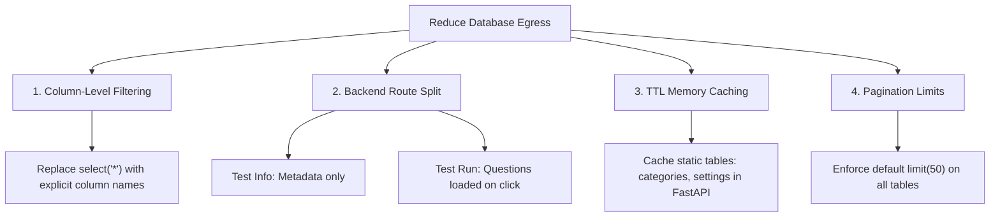

# Supabase Database Egress Optimization Report
> [!NOTE]
> Database egress represents the volume of data transferred out of the Supabase PostgreSQL database. In this architecture, this is primarily driven by your FastAPI backend queries. Serving optimized payloads from Supabase to your backend is the most effective way to lower resource usage.

---

## 1. Primary Causes of High Egress in TestoZa
After auditing the backend router endpoints, we identified three major areas where database queries fetch excessive data:

### A. The "Select Star" (`select("*")`) on Large Tables
The `tests` table contains massive JSONB columns:
*   `questions`: Contains complete question lists, LaTeX equations, options, metadata.
*   `solutions`: Contains detailed step-by-step explanations for all questions.
*   `settings`: Contains configuration rules.

When you load lists of tests (e.g., admin dashboard lists, public search tables, categories), querying `select("*")` forces Supabase to fetch and transmit these massive JSON blocks for every row.
*   **Impact:** A list of 20 tests with 100 questions each can translate to **15MB+ of payload egress** per request, even if the user only wanted to see the test titles and durations.

### B. Student Answers in Attempt Logs
The `attempts` and `combined_sessions` tables contain:
*   `answers`: Full JSON mapping of student responses.
*   `session_metadata`: Large device, tech stack, and progress logs.
*   Listing endpoints in `combined_sessions.py` and `attempts.py` query `select("*")` when displaying recent history.
*   **Impact:** Loading history rows transfers full student responses, inflating egress for every historical view.

---

## 2. Recommended Action Plan (No Feature Compromises)



### Strategy 1: Column-Level Filtering (Refactoring `select("*")`)
Instead of requesting all fields from database tables, refactor the backend queries to fetch only the identifiers and simple columns needed for list views.

#### Implementation Example for Test Lists (`backend/app/routers/tests/read.py` & `admin.py`)
```python
# BEFORE (High Egress)
response = db.table("tests").select("*").eq("created_by", user_id).execute()

# AFTER (Low Egress - 95% reduction)
response = db.table("tests").select(
    "id, title, total_questions, duration, created_by, custom_id, created_at, is_public, visibility, slug"
).eq("created_by", user_id).execute()
```

#### Implementation Example for Sessions (`backend/app/routers/combined_sessions.py`)
```python
# BEFORE (High Egress)
query = db.table("student_attempts").select("*").eq("user_id", student_id).execute()

# AFTER (Low Egress)
query = db.table("student_attempts").select(
    "id, test_id, score, status, started_at, submitted_at, duration"
).eq("user_id", student_id).execute()
```

---

### Strategy 2: Two-Step Loading for Exams
Currently, loading a test's instruction page or details screen fetches the entire test record (including questions).

*   **Step 1: Fetch Metadata (Instruction Screen):**
    Call a lightweight route like `/api/tests/{test_id}/info` which returns the title, creator, total marks, and rules (0.5 KB egress).
*   **Step 2: Fetch Questions (On clicking "Start Test"):**
    Only load `/api/tests/{test_id}/questions` when the student actually accepts the rules and begins the exam. This ensures users browsing your site do not trigger large egress payloads unless they actively take tests.

---

### Strategy 3: TTL Caching in FastAPI (In-Memory)
Some tables change very rarely (e.g., `categories`, `classes`, `app_settings`). Since FastAPI acts as a proxy, you can cache these queries in the backend memory for 5-10 minutes.

```python
from fastapi_cache import FastAPICache
from fastapi_cache.decorator import cache

# Caches the categories database query response for 10 minutes
@router.get("/")
@cache(expire=600)
async def get_categories():
    response = db.table("categories").select("*").execute()
    return response.data
```
*   **Impact:** If 1,000 visitors browse your homepage within 10 minutes, only **1 database query** goes to Supabase. The other 999 are served instantly from the FastAPI application memory with **0 database egress**.

---

### Strategy 4: Enforce Pagination Defaults
Ensure list endpoints always specify limits to prevent loading unbounded rows:
```python
# Ensure we limit results in all list queries
query = db.table("test_categories").select("test_id").eq("category_id", cat_id).limit(50).execute()
```

---

## 3. Impact Assessment

| Strategy | Est. Egress Saved | Difficulty | Flow Affected? |
| :--- | :--- | :--- | :--- |
| **Refactoring `select("*")`** | ~70% - 80% | Low | None (UI renders identical data) |
| **Split Info / Start Test** | ~15% | Medium | None (Requires minor frontend refactoring) |
| **TTL Caching** | ~10% | Low | None (Data updates are delayed by 5-10 mins max) |
| **Pagination Limits** | ~5% | Low | None |
