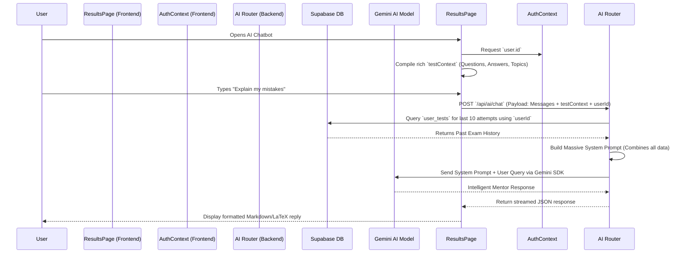

# TestoZa AI Chatbot: Comprehensive Architecture & Capabilities Guide

This document provides a complete overview of the upgraded **TestoZa AI Chatbot**. It details how the chatbot acts as an industry-level mentor, what data it can access, how it processes this data, and its internal working mechanisms.

---

## 1. What Can TestoZa AI Do?
TestoZa AI is no longer a simple chatbot; it is a **highly contextual, data-driven personal mentor**. 

- **Detailed Error Analysis**: It can explain exactly *why* a student got a specific question wrong by looking at the specific question text, the student's chosen answer, and the correct answer.
- **Identify Weaknesses & Strengths**: It accurately points out strong, moderate, and weak topics rather than just giving a generic score.
- **Generate Study Plans**: It can generate highly specific, time-bound revision schedules (e.g., "7-Day Action Plan") focusing precisely on the student's weakest topics.
- **Recognize Historical Trends**: It assesses past performance across multiple tests to identify patterns (e.g., "You consistently struggle with numerical questions in Kinematics").
- **Predict Ranks & Benchmark**: It can provide realistic mock rank estimations based on the difficulty and score of the current test.

---

## 2. What Data Can TestoZa AI Access?
TestoZa AI has deep, comprehensive access to the student's digital footprint on the platform to provide hyper-personalized advice.

### Current Test Data
- **Test Metadata**: Title, description, duration, total questions, and maximum marks.
- **Score Card**: Marks obtained, total percentage, accuracy rate.
- **Performance Counters**: Exact counts of Correct, Wrong, Partial, and Skipped questions.
- **Section Data**: Performance across different subjects/sections (e.g., Physics, Chemistry, Math).

### Deep Analytics
- **Topic Analysis**: A full breakdown of every topic tested, including how many questions were asked, the score obtained, and an automated label (`Strong`, `Moderate`, `Weak`).
- **Question-Level Insights**: For every wrong and skipped question, the AI knows:
  - The exact question text.
  - The options provided.
  - The answer the student chose.
  - The actual correct answer.

### Historical User Data
- **Past Exam History**: The backend automatically fetches the student's last 10 test attempts from the database (including test names, scores, and dates).

---

## 3. How Does TestoZa AI Access User Data?

The data pipeline works flawlessly between the frontend interface, the authentication context, and the secure backend server.



---

## 4. How Does It Analyze and Mentor? (The Analysis Method)

The core magic happens in the backend **System Prompt Generation Phase** (`_build_mentor_system_prompt`). The AI does not use a standard fine-tuning model; it utilizes **In-Context Learning (Prompt Engineering)** to inject the student's entire profile directly into the AI's short-term memory before every message.

### The System Prompt Architecture
Before the AI even sees the user's message, the backend constructs a massive hidden document containing:
1. **The Identity Declaration**: Instructs the model to act as "TestoZa AI — an experienced, warm, data-driven mentor."
2. **The Hard Data**: Inserts the exact scores, percentages, and accuracy.
3. **The Topic Table**: Explicitly lists every topic and attaches an emoji (`🟢 Strong`, `🟡 Moderate`, `🔴 Weak`).
4. **The "Mistake Ledger"**: A loop iterates through the student's wrong answers and injects them into the prompt (e.g., *"Q14 [Thermodynamics]: Student chose Option B, Correct was Option C"*).
5. **The History Ledger**: A chronological list of recent scores to provide context on overall improvement.
6. **Strict Mentorship Rules**: Finally, it imposes rules on the AI output:
   - *Never be vague.*
   - *Always cite data.*
   - *Be honest but encouraging.*
   - *Output gorgeous Markdown with LaTeX for math.*

---

## 5. Pictorial Representation of the Architecture

```mermaid
graph TD
    subgraph Frontend [Frontend: React & Context]
        R[ResultsPage.tsx] -->|Extracts Analysis| C[AIChatBotContext]
        T[useTest Context] -->|Provides Qs & As| C
        A[AuthContext] -->|Provides userId| C
        C -->|Payload via HTTP| B[AIChatBot Component]
    end

    subgraph Backend [Backend: FastAPI (ai.py)]
        B -->|POST /chat| E[FastAPI Endpoint]
        E -->|Fetch History| DB[(Supabase DB)]
        DB -->|Last 10 Tests| E
        E -->|Format Data| S[System Prompt Builder]
        
        S --> P1[1. Test Overview & Score]
        S --> P2[2. Topic Performance Matrix]
        S --> P3[3. Question-level Mistake Ledger]
        S --> P4[4. Historical Trends]
        S --> P5[5. Mentor Persona Rules]
        
        P1 & P2 & P3 & P4 & P5 --> F[Final System Prompt]
    end

    subgraph AI Engine [Google Gemini 2.0 Flash]
        F --> G[Gemini Engine]
        U[User Query] --> G
        G -->|Actionable Output| O[Mentor Response]
    end

    O -.->|Renders Markdown/LaTeX| B
```

---

## 6. Summary of Key Upgrades
- **Zero Hallucinations on Content**: Because the AI is actively fed the *actual* question text and the student's exact answer, it won't hallucinate or provide generic advice. It diagnoses the specific conceptual error.
- **Data Privacy**: The database lookup for past history happens entirely on the server side using the secure backend connection. The frontend only passes the `user.id`.
- **High Performance**: It leverages the ultra-fast `gemini-2.0-flash` model, ensuring minimal latency even when processing massive context blocks of test data.
