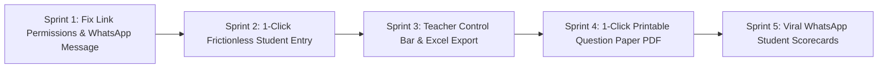

# TestoZa Platform Retention & User Funnel Diagnostic Report

**Target Audience:** Engineering, Product & Intern Teams  
**Data Source:** Supabase Production Database (`tests`, `user_tests`, `page_views`, `sessions`, `profiles`) & Codebase Audit  
**Date:** August 2026  
**Document Location:** `plans/TestoZa_Teacher_Retention_Diagnostic_Report.pdf`

---

## 1. Executive Summary

Over the past quarter, dozens of educators, coaching teachers, and institutions (e.g. *Kunal Saini, Yamuna Mukunuri, Fernando Camelon, Sujan Deep, Satyam Institute, Shanti Press*) have onboarded onto TestoZa, generated comprehensive tests using the AI engine, and spent **15 to 70 minutes taking the full test themselves**.

However, **less than 5% of tests ever receive a single student attempt**. Creators evaluate the platform once or twice, achieve good scores on their self-attempts, and then churn completely.

### The "Pilot Test Paradox" Core Finding
Teachers **love the AI generator and the NTA CBT simulator**—that is why they spend 45+ minutes taking their own exam. The drop-off occurs because of **three structural friction walls** immediately after test creation:
1. **Silent Link Permission Blocks** (`visibility: 'private'` blocking student access).
2. **A 4-Step Student Onboarding Wizard** with storage diagnostics, login gates, and checkbox barriers.
3. **Lack of Teacher-Centric Outputs** (No instant Excel gradebook export or 1-click printable Question Paper PDF).

---

## 2. Database Evidence & Real User Journeys

An audit of the Supabase tables reveals the exact journey of high-intent teachers:

| Teacher / Institute | Test Created | Qs | Creator Action | Student Takers | Outcome |
| :--- | :--- | :---: | :--- | :---: | :--- |
| **Kunal Saini** *(Esaral / Dheeraj Saini)* | JEE Advanced Paper 1 Mock Test | 52 | Attempted self for 69 mins (Score: 63/150). Created 3 more tests. | **0 Students** | Churned after Day 1 |
| **Yamuna Mukunuri** *(Teacher)* | DSC Physical Education Exam | 108 | Tested self (Score: 83/100). Tested with 1 peer account. | **0 Students** | Churned after 3 tests |
| **Fernando Camelon** *(Chemistry Teacher)* | Inorganic Analytical Chemistry | 100 | Configured strict schedule & conduct mode. Tested flow. | **0 Students** | Churned |
| **Sujan Deep H** *(Teacher)* | Operating System Practice Test | 30 | Created via AI, took live test (Score: 28/30), visited `/results`. | **0 Students** | Churned |

---

## 3. The 5 Structural Friction Points

### 🔴 Friction 1: The "Private vs Conduct" Permissions Trap (Silent Link Failure)
In `frontend/src/pages/TestIntroPage.tsx` (lines 463–487):
* When a teacher creates a test, the database sets `visibility = 'private'` by default. When the teacher tests their own link, it works because `user.id === test.created_by`.
* **The Failure:** If a teacher copies the URL from their browser bar (or uses the fallback link in `shareUtils.ts`) and pastes it into their student WhatsApp group, **every student receives a 404 or "Test Private" error**. The teacher assumes the link failed and abandons the platform.

### 🟠 Friction 2: The 4-Step Student Intro Wall (Excessive Student Friction)
When a student opens a test link on mobile, they face a 4-step wizard before seeing any question:
1. **Step 1 (Overview):** Must click "Continue".
2. **Step 2 (Verification):** 5-second loading bar (*"Running diagnostics & vacating cache..."*), followed by a mandatory login prompt (*"Continue with Google"*).
3. **Step 3 (Candidate Form):** Asks for form input.
4. **Step 4 (Final Checklist):** Disables the "Start Test" button until a checkbox is ticked (*"I confirm I have closed all other tabs..."*).
* **Competitor Benchmark:** In Google Forms or Testportal, a student enters **Name + Roll No** and is on Question 1 in **3 seconds** without signing in.

### 🟣 Friction 3: The Teacher "Value Deficit" After Test Completion
When a teacher finishes taking the test, they land on `/results`. This page is designed for an **individual student** (Confetti, Score, AI Rank Predictor).
* **What the teacher actually needs to see:**
  * **1-Click Excel Export (.xlsx):** Columns for `[Roll No, Student Name, Marks, Accuracy, Time]`.
  * **Class Leaderboard / Live Submissions Monitor.**
  * **Question Difficulty Heatmap:** *"Which question was failed by 70% of students?"*

### 🏷️ Friction 4: Coaching Identity & Platform Branding
Teachers in India guard their student base closely. If the live test interface prominently features third-party platform branding and vote buttons rather than their own **Institute Logo & Header**, teachers refuse to circulate the link to avoid student disintermediation.

### 📄 Friction 5: Missing Hybrid/Offline Workflow (Printable PDF)
Over 70% of Indian coaching centers conduct physical offline weekly tests. When teachers realize TestoZa cannot export a **clean 2-column printable Question Paper + OMR Key PDF** with institute watermark, they realize it doesn't solve their offline classroom printing needs and leave.

---

## 4. Competitor Benchmark Matrix

| Feature Dimension | Google Forms | Testportal / FlexiQuiz | TestoZa (Current) | TestoZa (Target) |
| :--- | :--- | :--- | :--- | :--- |
| **Student Access Barrier** | 🟢 Zero Friction | 🟢 Direct Link | 🔴 4-Step Wizard + Auth | 🟢 **1-Click Name & Go** |
| **Link Reliability** | 🟢 100% Guaranteed | 🟢 100% Guaranteed | 🔴 Broken by Private flag | 🟢 **Bulletproof Public URLs** |
| **AI Test Creation** | 🔴 None | 🟡 Basic | 🟢 Best-in-Class (AI Moat) | 🟢 **Retain & Enhance** |
| **Live CBT Interface** | 🔴 Plain Form | 🟡 Standard Quiz | 🟢 Real NTA JEE/NEET UI | 🟢 **Real NTA JEE/NEET UI** |
| **Teacher Gradebook Export** | 🟢 Live Google Sheets | 🟢 1-Click Excel (.xlsx) | 🔴 Hidden / Mock Data | 🟢 **1-Click Excel + PDF** |
| **Coaching White-labeling** | 🔴 None | 🟡 Paid Feature | 🟡 Partial (DB only) | 🟢 **Full Header & Watermark** |

---

## 5. Step-by-Step Engineering Roadmap for Interns

### Sprint 1: Bulletproof Link Sharing & Permission Architecture
- **Fix Default Visibility:** Ensure any test generated by a creator is immediately shareable via `/test/:slug` or `/test/:id` without showing "Test Private".
- **Clean Share Message in `shareUtils.ts`:** Replace fallback error-prone messages with a clean WhatsApp invite template containing title, duration, marks, and direct link.
- **Eliminate Conduct vs Private Confusion:** Merge Conduct Exam settings directly into Test Settings so links never fail.

### Sprint 2: Streamline Student Entry to 1-Click Lobby
- **Remove 4-Step Stepper:** Replace with a clean, single-screen lobby.
- **Remove Storage Clearing Diagnostic:** Delete the simulated 5-second storage progress bar.
- **Guest Student Name Input:** Allow students to enter "Name" (and optional Roll Number) without forcing Google Login.

### Sprint 3: Teacher Control Bar & Instant Excel Gradebook Export
- **Post-Test Creator Bar:** When the test creator views `/results` or `/test-analysis/:id`, display a prominent sticky bar:
  `[ 📥 Export Excel Sheet (.xlsx) ]` `[ 📋 Copy WhatsApp Invite ]` `[ 🖨️ Print Exam PDF ]`.
- **Real Live Submissions Table:** Ensure `FullTestAnalysisPage.tsx` renders real candidate submissions with zero fallback mock data for active tests.

### Sprint 4: 1-Click Printable Question Paper & Answer Key (PDF)
- Implement a 2-column clean A4 printable view with:
  1. Coaching Name & Logo header.
  2. Questions with LaTeX equations & diagrams.
  3. Answer Key + Explanations sheet at the end.

### Sprint 5: Viral WhatsApp Loops & Student Result Cards
- Add a **"Send Scorecard to Teacher on WhatsApp"** button on the student's result screen.
- Generates a viral notification loop that alerts teachers after every student submission.
