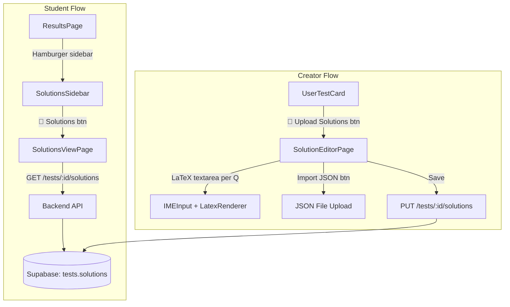
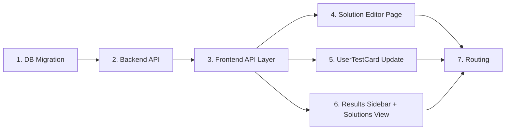

# Detailed Solutions Feature — Implementation Plan

> Add the ability for test creators to upload detailed solutions per question.  
> Students see solutions on the Results page after submission via a sidebar menu.

---

## UI Reference Mockups

### Solution Editor (Creator Dashboard)


### Results Page — Sidebar Navigation


### Solution Viewer (Student View)


---

## User Review Required

> [!IMPORTANT]
> **Database Column Addition**: A new JSONB column `solutions` will be added to the `tests` table in Supabase. This is a non-breaking change (nullable column), but requires running a SQL migration.

> [!NOTE]
> **No separate table**: Solutions are stored as a JSONB field on the `tests` table itself (`solutions: { "1": "solution text...", "2": "..." }`), keyed by question ID. This avoids join overhead and keeps the data tightly coupled to the test. If the test is deleted, solutions go with it.

> [!WARNING]
> **Solutions visibility**: Solutions will only be visible to students **after** they submit the test. The backend does NOT serve solutions in the regular `GET /tests/:id` endpoint to prevent cheating. Solutions are fetched via a **separate endpoint** (`GET /tests/:id/solutions`) that can be gated later if needed.

---

## Architecture Overview



---

## Proposed Changes

### Component 1 — Database (Supabase Migration)

**Goal**: Add a `solutions` JSONB column to the `tests` table.

#### [NEW] [migration_solutions_v1.sql](file:///d:/Yuga%20Yatra/nkc-Test-platform/supabase/migration_solutions_v1.sql)

```sql
-- Add solutions column to tests table
ALTER TABLE tests ADD COLUMN IF NOT EXISTS solutions JSONB DEFAULT NULL;

-- Add comment for documentation
COMMENT ON COLUMN tests.solutions IS 
  'JSONB map of question_id → solution_text. Supports LaTeX/KaTeX/mhchem markdown.';
```

- Column is **nullable** — no solutions means `NULL` (not an empty object)
- No RLS changes needed — uses existing tests table policies

---

### Component 2 — Backend API

**Goal**: Two new endpoints — one to save solutions, one to fetch them. Kept in a separate router file for clean separation.

#### [NEW] [solutions.py](file:///d:/Yuga%20Yatra/nkc-Test-platform/backend/app/routers/solutions.py)

New FastAPI router with two endpoints:

| Method | Path | Purpose | Auth |
|--------|------|---------|------|
| `PUT` | `/tests/{test_id}/solutions` | Save/update solutions JSONB | Creator only (checks `created_by`) |
| `GET` | `/tests/{test_id}/solutions` | Fetch solutions for viewing | Public (post-submission) |

**`PUT /tests/{test_id}/solutions`** — Save Solutions
- Request body: `{ "solutions": { "1": "Step 1: ...", "2": "Using $\\ce{H2O}$..." } }`
- Validates test exists and caller is the creator (`created_by` check)
- Updates only the `solutions` column via `db.table("tests").update({"solutions": payload.solutions}).eq("id", test_id)`
- Returns `{ "success": true, "count": N }` where N = number of questions with solutions

**`GET /tests/{test_id}/solutions`** — Fetch Solutions
- Returns `{ "solutions": {...}, "has_solutions": true/false }`
- Returns `null` gracefully if no solutions uploaded yet
- No auth required (students access after submission — frontend controls visibility)

#### [MODIFY] [main.py](file:///d:/Yuga%20Yatra/nkc-Test-platform/backend/app/main.py)

Register the new solutions router:
```python
from app.routers import solutions
app.include_router(solutions.router, prefix="/api", tags=["solutions"])
```

---

### Component 3 — Frontend API Layer

**Goal**: Add API functions for solutions CRUD.

#### [MODIFY] [testsApi.ts](file:///d:/Yuga%20Yatra/nkc-Test-platform/frontend/src/lib/testsApi.ts)

Add two new exported functions:

```typescript
// Save solutions for a test (creator action)
export async function saveSolutions(testId: string, solutions: Record<string, string>) { ... }

// Fetch solutions for a test (student view)
export async function fetchSolutions(testId: string) { ... }
```

---

### Component 4 — Solution Editor Page (Creator)

**Goal**: Full-page editor where creators write/edit solutions for each question. Accessible from the `UserTestCard` dropdown menu.

#### [NEW] [SolutionEditorPage.tsx](file:///d:/Yuga%20Yatra/nkc-Test-platform/frontend/src/pages/SolutionEditorPage.tsx)

**Features**:
1. **Header**: Test title + "Import Solutions JSON" button + "Save All" button
2. **Question List**: Scrollable list of all questions in the test
3. **Per-question card**:
   - Question number badge + question text rendered via `LatexRenderer`
   - Correct answer displayed below (read-only)
   - `<Textarea>` (or `IMEInput`) for writing the solution
   - Live preview toggle showing rendered LaTeX/mhchem output via `LatexRenderer`
4. **JSON Import**: File input that accepts `.json` file with format:
   ```json
   {
     "solutions": ["Solution for Q1...", "Solution for Q2...", ...]
   }
   ```
   Maps array index → question ID and fills in text areas
5. **Save**: Calls `saveSolutions(testId, solutionsMap)` — shows toast on success/error
6. **Auto-save indicator**: Optional — shows "Unsaved changes" warning

**Data Flow**:
- On mount: Fetch test data (`fetchTestById`) + existing solutions (`fetchSolutions`)
- Pre-populate text areas if solutions already exist
- On save: Collect all non-empty text areas into `{ [q.id]: solutionText }` map

---

### Component 5 — UserTestCard Update (Creator Dashboard)

**Goal**: Add "📝 Upload Solutions" option to the test card's dropdown menu.

#### [MODIFY] [UserTestCard.tsx](file:///d:/Yuga%20Yatra/nkc-Test-platform/frontend/src/components/UserTestCard.tsx)

- Add a new prop: `onUploadSolutions: (test: any) => void`
- Add new `DropdownMenuItem` between "Assign Class" and "Delete Test":

```tsx
<DropdownMenuSeparator />
<DropdownMenuItem onClick={() => onUploadSolutions(test)}>
    <FileText className="mr-2 h-4 w-4" /> Upload Solutions
</DropdownMenuItem>
```

#### [MODIFY] [UserTestManager.tsx](file:///d:/Yuga%20Yatra/nkc-Test-platform/frontend/src/pages/UserTestManager.tsx)

- Add `handleUploadSolutions` function that navigates to `/solutions-editor/:testId`
- Pass it as `onUploadSolutions` prop to `UserTestCard`

---

### Component 6 — Results Page Sidebar + Solutions View

**Goal**: Replace the current top action buttons with a hamburger sidebar navigation.

#### [MODIFY] [ResultsPage.tsx](file:///d:/Yuga%20Yatra/nkc-Test-platform/frontend/src/pages/ResultsPage.tsx)

**Sidebar (Sheet component)**:
- Hamburger icon (☰) in top-left triggers a `Sheet` (from shadcn/ui) sliding in from the left
- Menu items:
  | Icon | Label | Action |
  |------|-------|--------|
  | 📊 `BarChart3` | Detailed Analysis | Navigate to `/analysis` |
  | 📝 `FileText` | Solutions | Navigate to `/solutions/:testId` (or toggle inline) |
  | 🔗 `Share2` | Share with Friends | Copy link + toast |
  | 🔄 `RotateCcw` | Retake Test | Reset + navigate |
  | 🏠 `Home` | Back to Home | Navigate to `/` |

- "Solutions" item shows a `Badge` saying "NEW" if `hasSolutions` is true
- On mount, call `fetchSolutions(testId)` to check if solutions exist (just check `has_solutions` flag)

#### [NEW] [SolutionsViewPage.tsx](file:///d:/Yuga%20Yatra/nkc-Test-platform/frontend/src/pages/SolutionsViewPage.tsx)

**Full-page solution viewer** showing:
1. Question number + question text (rendered with `LatexRenderer`)
2. Student's answer vs correct answer (same UI as ResultsPage accordion)
3. **Solution card**: Indigo-tinted card with `LatexRenderer` rendering the solution text
4. **Question navigator**: Bottom bar with prev/next buttons + numbered circles
5. "No solution available for this question" placeholder if solution is missing

**Data flow**:
- Receives test data + answers from navigation state (same as AdvancedAnalysis page pattern)
- Fetches solutions via `fetchSolutions(testId)`

---

### Component 7 — Routing

#### [MODIFY] [App.tsx](file:///d:/Yuga%20Yatra/nkc-Test-platform/frontend/src/App.tsx)

Add two new routes:

```tsx
<Route path="/solutions-editor/:testId" element={<SolutionEditorPage />} />
<Route path="/solutions/:testId" element={<SolutionsViewPage />} />
```

---

## Summary of All File Changes

| Layer | File | Change Type | Description |
|-------|------|-------------|-------------|
| DB | `migration_solutions_v1.sql` | NEW | Add `solutions` JSONB column |
| Backend | `solutions.py` | NEW | PUT + GET endpoints for solutions |
| Backend | `main.py` | MODIFY | Register solutions router |
| Frontend | `testsApi.ts` | MODIFY | Add `saveSolutions()` + `fetchSolutions()` |
| Frontend | `SolutionEditorPage.tsx` | NEW | Creator's solution editor page |
| Frontend | `SolutionsViewPage.tsx` | NEW | Student's solution viewer page |
| Frontend | `UserTestCard.tsx` | MODIFY | Add "Upload Solutions" menu item |
| Frontend | `UserTestManager.tsx` | MODIFY | Add handler + pass prop |
| Frontend | `ResultsPage.tsx` | MODIFY | Add hamburger sidebar |
| Frontend | `App.tsx` | MODIFY | Add 2 new routes |

---

## Implementation Order



1. **Database migration** — run the SQL to add column
2. **Backend endpoints** — `solutions.py` + register in `main.py`
3. **Frontend API** — `saveSolutions` + `fetchSolutions` in `testsApi.ts`
4. **Solution Editor** — `SolutionEditorPage.tsx` (creator side)
5. **UserTestCard + Manager** — add menu item + navigation
6. **Results Sidebar + Solutions View** — `ResultsPage.tsx` sidebar + `SolutionsViewPage.tsx`
7. **Routing** — register both new pages in `App.tsx`

---

## Verification Plan

### Manual Verification (Recommended)

Since this project has no automated test suite, verification will be manual through the browser:

**Creator Flow Testing:**
1. Start the dev server (`npm run dev` in frontend, `uvicorn` in backend)
2. Log in as a creator/admin
3. Go to the test management dashboard
4. Find any test card → click the 3-dot menu → verify "Upload Solutions" option appears
5. Click "Upload Solutions" → verify the Solution Editor page opens
6. Verify all questions from the test are listed with their correct answers
7. Write a LaTeX solution (e.g., `$\ce{H2SO4}$` or `$$x = \frac{-b \pm \sqrt{b^2-4ac}}{2a}$$`) in one text area
8. Toggle the preview → verify LaTeX renders correctly
9. Click "Save All" → verify success toast appears
10. Reload the page → verify solutions persist (fetched from backend)
11. Test the JSON import by uploading a `.json` file with a `solutions` array → verify text areas are filled

**Student Flow Testing:**
1. Open a test as a student (incognito or different account)
2. Complete and submit the test
3. On the Results page, verify the hamburger menu (☰) appears in the top-left
4. Click the hamburger → verify the sidebar slides in with all menu items
5. Click "Solutions" → verify the Solutions Viewer page opens
6. Verify: question text, your answer, correct answer, and the solution are all displayed
7. Verify LaTeX/mhchem content renders correctly in the solution
8. Test prev/next navigation between questions
9. Test a question with no solution → verify "No solution available" placeholder shows

**Edge Cases:**
- Test with no solutions uploaded → Solutions menu item should still show but display "No solutions available yet"
- Test with partial solutions (only some questions) → missing ones show placeholder
- Empty solution text areas should not be saved
- Very long LaTeX solutions should not break the layout

> [!TIP]
> **Quick smoke test**: After implementing, the creator should be able to go from test card → upload a solution → save → then take the test as a student → submit → see that solution on the results page. This end-to-end flow validates all layers.
