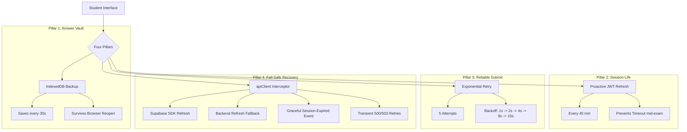

# Implementation Guide: Test Submission Resilience (Phase 1 & 2)

This document explains the architecture and implementation details of the test submission reliability system. New interns should read this to understand how we prevent data loss during long (2-3 hour) exams regardless of network stability.

## Overview

The system is built on **four pillars of resilience** to ensure that student answers are never lost, even if their computer crashes or the internet fails at the exact moment of submission.

---

## 1. The Answer Vault (`AnswerVault` in `testResilience.ts`)

**Problem:** If a student spends 3 hours on a test and their browser crashes or they accidentally close the tab, all unsaved progress in React state is lost.

**Solution:** 
- We use **IndexedDB** (via the `AnswerVault` utility) to save the `answers` object locally on the student's hardware.
- Unlike `localStorage`, IndexedDB is designed for larger datasets and is more robust.
- **Trigger:** In `TestPage.tsx`, a `useEffect` saves to the vault every 30 seconds of inactivity.
- **Cleanup:** The vault is cleared **only** after a successful server response.

## 2. Proactive Security (`startProactiveTokenRefresh`)

**Problem:** Supabase JWT tokens typically expire. If a session invalidates during a 2-hour exam, the student will be unable to submit.

**Solution:**
- We start a background timer (`startProactiveTokenRefresh`) when the test loads.
- It silently calls the refresh logic every **45 minutes**.
- **Important:** We have also increased the Supabase **JWT Expiry to 8 hours (28800s)**, making this a secondary safety net.

## 3. Reliable Submission (`saveAttemptWithRetry`)

**Problem:** A single network packet loss at the moment of clicking "Submit Test" would previously show a "Failed" error and stop.

**Solution:**
- We wrapped the API call in an **Exponential Backoff Retry** loop.
- **Strategy:** If the first attempt fails, it waits 1s, then 2s, then 4s, etc., up to 5 attempts.
- **UI Feedback:** The student sees a "Retrying submission..." loading toast instead of a scary error message.

## 4. Fail-Safe Session Recovery (`apiClient.ts`)

**Problem:** If Pillar 2 fails (e.g. internet was down during the 45-min refresh) and the user submits after their token has expired, they get a `401 Unauthorized`.

**Solution:**
The `apiClient` interceptor automatically runs a **3-Strategy Cascade** on any 401 error:
- **Strategy A (Supabase SDK):** Immediately tries `supabase.auth.refreshSession()`.
- **Strategy B (Backend Fallback):** If SDK fails, calls `/auth/refresh` on our server and re-warms the SDK.
- **Strategy C (Graceful Event):** If all else fails, instead of hard-redirecting to `/login` (which wipes the tab), it fires a `testoza:session-expired` event.
- **Bonus:** It also automatically retries **500/503 (Cold Start)** errors up to 2 times.

---

## Technical Files to Study

1.  **`src/lib/testResilience.ts`**: Contains the core logic for Retries, IndexedDB, and Token Refresh.
2.  **`src/lib/attemptsApi.ts`**: See `saveAttemptWithRetry` function.
3.  **`src/pages/TestPage.tsx`**: Look for "Phase 2" comments to see where effects are mounted.

## Supabase Auth Configuration (Dashboard)

For the resilience system to work perfectly during 7-8 hour exams, the following settings **MUST** be maintained in the Supabase Dashboard:

1.  **JWT Expiry:** `28800` (8 hours). 
    - *Path:* Authentication -> Configuration -> Sessions.
    - *Why:* Ensures the initial token remains valid for the full exam duration.

2.  **Persistent Sessions:** `Enabled`.
    - *Why:* Keeps the student logged in if they accidentally refresh or close the browser.

3.  **Auto Refresh Tokens:** `Enabled`.
    - *Why:* Allows the Supabase SDK to rotate tokens automatically in the background.

## Best Practices for Interns

- **Never delete the vault early:** Only call `AnswerVault.clear()` inside the `.then()` or `success` block of a verified server response.
- **Throttle your saves:** Don't write to IndexedDB on every keystroke; use the 30s timer currently implemented to prevent performance lag.
- **Assume network failure:** Always write code as if the internet will disconnect in the next 5 seconds.

---

## Testing & Verification (Interns Guide)

Since actual exams last 8 hours, use these methods to verify the Fail-Safe logic in minutes:

### Method 1: Manual Token Corruption
*Simulates an invalid signature.*
1. Log in -> Open **DevTools** (F12) -> **Application** -> **Local Storage**.
2. Find `testoza_token` and **delete the last 5 characters**.
3. Trigger a save/submit.
4. **Expected:** A `401` error in the network tab, followed by an automatic `refreshSession` call, followed by a successful retry.

### Method 2: Hyper-Fast Expiry
*Simulates a real-world timeout.*
1. Go to **Supabase Dashboard** -> Auth Settings.
2. Temporarily set **JWT Expiry** to `60` seconds.
3. Log in, wait 61 seconds, then click "Submit".
4. **Expected:** Seamless recovery. (Remember to revert back to `28800` after testing).

### Method 3: Strategy C (The Last Resort)
*Simulates a total session failure.*
1. **Delete** `testoza_refresh_token` from Local Storage and corrupt `testoza_token`.
2. Trigger an action.
3. **Expected:** Both refreshes fail, and a `testoza:session-expired` event is dispatched. The exam page should show a custom re-login dialog while keeping the `AnswerVault` data safe.
