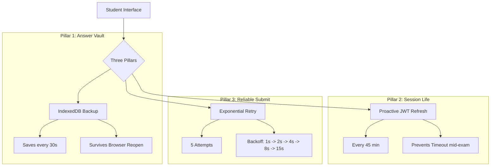

# Implementation Guide: Test Submission Resilience (Phase 1 & 2)

This document explains the architecture and implementation details of the test submission reliability system. New interns should read this to understand how we prevent data loss during long (2-3 hour) exams regardless of network stability.

## Overview

The system is built on **three pillars of resilience** to ensure that student answers are never lost, even if their computer crashes or the internet fails at the exact moment of submission.

---

## 1. The Answer Vault (`AnswerVault` in `testResilience.ts`)

**Problem:** If a student spends 3 hours on a test and their browser crashes or they accidentally close the tab, all unsaved progress in React state is lost.

**Solution:** 
- We use **IndexedDB** (via the `AnswerVault` utility) to save the `answers` object locally on the student's hardware.
- Unlike `localStorage`, IndexedDB is designed for larger datasets and is more robust.
- **Trigger:** In `TestPage.tsx`, a `useEffect` saves to the vault ogni 30 seconds of inactivity.
- **Cleanup:** The vault is cleared **only** after a successful server response.

## 2. Proactive Security (`startProactiveTokenRefresh`)

**Problem:** Supabase JWT tokens typically expire in 1 hour. If a student starts a 2-hour exam, their session will be invalid by the time they click "Submit".

**Solution:**
- We start a background timer (`startProactiveTokenRefresh`) when the test loads.
- It silently calls the `/auth/refresh` endpoint every **45 minutes**.
- This ensures the token is always "fresh" when the student finally submits.

## 3. Reliable Submission (`saveAttemptWithRetry`)

**Problem:** A single network packet loss at the moment of clicking "Submit Test" would previously show a "Failed" error and stop.

**Solution:**
- We wrapped the API call in an **Exponential Backoff Retry** loop.
- **Strategy:** If the first attempt fails, it waits 1s, then 2s, then 4s, etc., up to 5 attempts.
- **UI Feedback:** The student sees a "Retrying submission..." loading toast instead of a scary error message.

---

## Technical Files to Study

1.  **`src/lib/testResilience.ts`**: Contains the core logic for Retries, IndexedDB, and Token Refresh.
2.  **`src/lib/attemptsApi.ts`**: See `saveAttemptWithRetry` function.
3.  **`src/pages/TestPage.tsx`**: Look for "Phase 2" comments to see where effects are mounted.

## Best Practices for Interns

- **Never delete the vault early:** Only call `AnswerVault.clear()` inside the `.then()` or `success` block of a verified server response.
- **Throttle your saves:** Don't write to IndexedDB on every keystroke; use the 30s timer currently implemented to prevent performance lag.
- **Assume network failure:** Always write code as if the internet will disconnect in the next 5 seconds.
