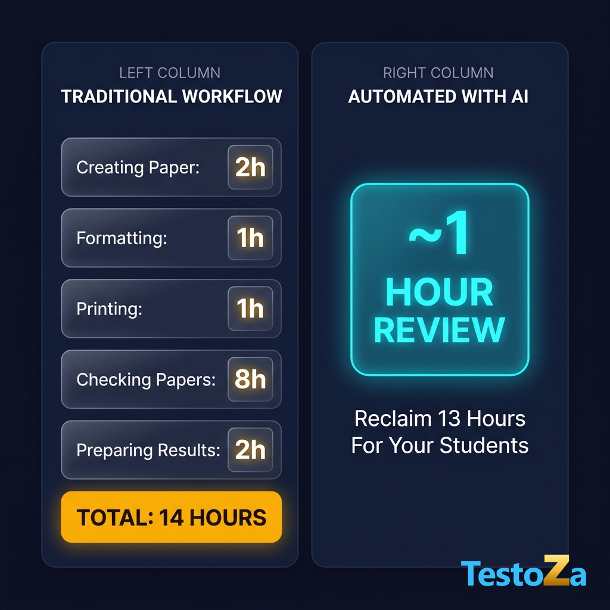

# Post 12 — Storytelling: Giving Time Back to Teachers

---

## 📱 LinkedIn Post Copy

**Headline / Hook:**
A teacher spends 14 hours every single week on tasks that a machine can assist with in minutes. ⏰👇

Here is how those 14 hours disappear:

- 📝 **Creating the paper:** 2 hours
- 📐 **Formatting & layout:** 1 hour
- 🖨️ **Printing & prep:** 1 hour
- ✍️ **Checking papers:** 8 hours
- 📊 **Preparing results & feedback:** 2 hours

**Total:** 14 hours lost to routine admin work.

Imagine reducing all of that to **just ~1 hour of high-level review**.

That’s **13 hours saved every single week**—time you can give back to your students, your lesson prep, or your personal life.

AI shouldn't replace teachers. It should replace the repetitive work that drains them.

👉 Experience faster, automated test creation & grading with **TestoZa**.

#EdTech #TeachingLife #TeacherBurnout #AIInEducation #Education #SchoolLeaders #TestoZa #FutureOfLearning

---

## 📘 Facebook Post Copy

A teacher spends:
• 2 hours creating the paper
• 1 hour formatting it
• 1 hour printing
• 8 hours checking papers
• 2 hours preparing results

Total: **14 HOURS.** ⏱️

Now imagine reducing all of that routine manual work down to **around an hour of review**.

That's 13 hours you get back to actually teach, mentor, and give personal attention to your students. ❤️

Let automation handle the paperwork so you can focus on what truly matters: inspiring young minds.

✨ Learn how TestoZa simplifies paper creation & evaluation today!

---

## 🎨 Asset Details & Options
Both poster image variants are available in the `recycle/` directory:

1. **Option A (Ultra-Clean Layout):** `recycle/teacher_time_poster.png`
   - High readability two-column structured cards.
   - Exact breakdown numbers matching post prompt.
   - Logo in dedicated bottom-right open space.

2. **Option B (Detailed Infographic Style):** `recycle/teacher_time_poster_infographic.png`
   - Rich graphic layout with workflow step arrows & badges.
   - Logo cleanly positioned above footer bar.

