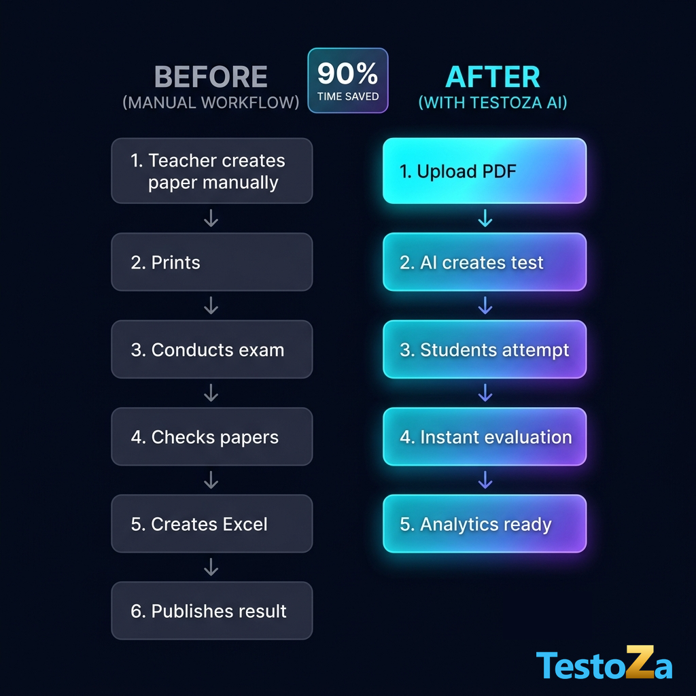

# Post 7 — Before vs After: Transforming the Examination Workflow

---

## 📱 LinkedIn Post Copy

**Headline / Hook:**
Manual exam administration takes 6 tedious steps. AI reduces it to 5 effortless clicks. ⚡👇

Look at the difference:

❌ **BEFORE (Manual Workflow)**
1️⃣ Teacher creates paper manually
2️⃣ Prints physical copies
3️⃣ Conducts exam
4️⃣ Manually checks papers
5️⃣ Creates Excel marksheet
6️⃣ Publishes result

---

✨ **AFTER (With TestoZa AI)**
1️⃣ Upload PDF
2️⃣ AI creates test instantly
3️⃣ Students attempt online
4️⃣ Instant automatic evaluation
5️⃣ Analytics ready in real-time

**The Result?** 90% time saved and zero manual grading fatigue.

Work smarter, not harder. Give your faculty the AI tools they deserve.

👉 Automate your testing workflow with **TestoZa** today!

#EdTech #WorkflowAutomation #EducationTechnology #TeacherLife #AIInEducation #TestoZa #SchoolManagement

---

## 📘 Facebook Post Copy

From 6 exhausting steps to 5 automated clicks. 🚀

**BEFORE:**
Teacher creates paper manually ➔ Prints ➔ Conducts exam ➔ Checks papers ➔ Creates Excel ➔ Publishes result.

**AFTER WITH TESTOZA AI:**
Upload PDF ➔ AI creates test ➔ Students attempt ➔ Instant evaluation ➔ Analytics ready.

Cut down grading stress and reclaim your valuable teaching time! ❤️

✨ Transform your exam process with TestoZa now.

---

## 🎨 Asset Details
- **Generated Graphic:** `recycle/before_after_poster.png`
- **Theme:** TestoZa Deep Slate-Indigo UI Theme with Glowing Glassmorphism
- **Logo Integration:** Integrated seamlessly in the bottom right corner
